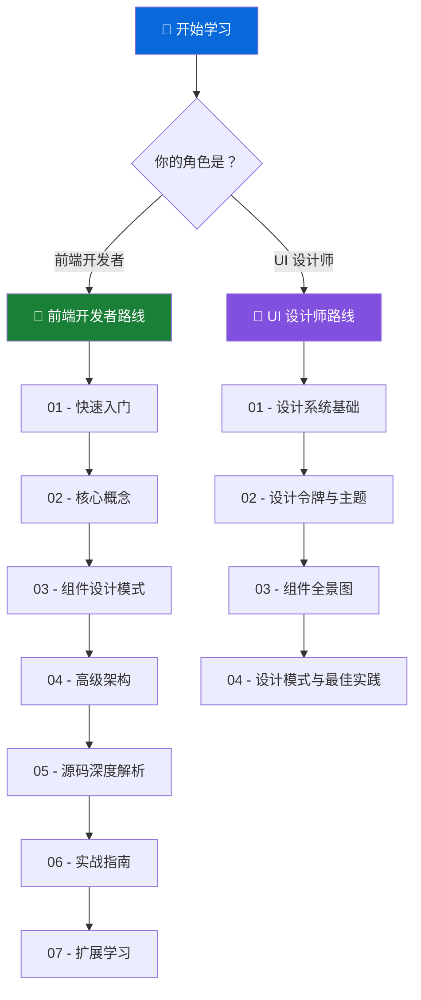

# 🎓 Primer React 系统化学习教程

> **Primer React** 是 GitHub 官方基于 React 构建的设计系统组件库，为 GitHub 及其生态产品提供统一的 UI 组件和设计规范。

---

## 📖 项目简介（What & Why）

**Primer React** 解决了大型产品中 UI 一致性、可维护性和开发效率的核心挑战：

| 问题                                | Primer React 的解决方案                     |
| ----------------------------------- | ------------------------------------------- |
| 不同团队开发的 UI 风格不一致        | 提供统一的设计令牌（Design Tokens）和组件库 |
| 重复造轮子、样式碎片化              | 60+ 开箱即用的高质量组件                    |
| 无障碍访问（Accessibility）难以保证 | 组件内置 ARIA 属性和键盘导航                |
| 暗色模式、主题切换开发成本高        | 完整的主题系统，支持亮/暗/自动模式          |
| CSS 运行时注入性能瓶颈              | CSS Modules 方案，比运行时快 60%            |

**一句话定位**：Primer React 是连接设计与工程的桥梁，让"设计意图"能够精确、高效地转化为可运行的代码。

---

## 🗺️ 学习路径地图（Learning Roadmap）



---

## 👥 适合人群

### 🖥️ 前端开发者（Front-end Developer）

如果你是前端开发者，这套教程将帮助你：

- 快速上手 Primer React 组件库
- 理解组件的设计原则和 API 规范
- 深入源码级别理解架构决策
- 学会设计系统级组件库的核心思想

**推荐学习路径**：

| 阶段    | 文档                                                         | 预计时间 | 学习重点                         |
| ------- | ------------------------------------------------------------ | -------- | -------------------------------- |
| 🟢 入门 | [01 - 快速入门](./front-end/01-getting-started.md)           | 30 分钟  | 安装、基础使用、项目结构         |
| 🟢 入门 | [02 - 核心概念](./front-end/02-core-concepts.md)             | 45 分钟  | 主题系统、样式方案、组件分类     |
| 🟡 进阶 | [03 - 组件设计模式](./front-end/03-component-patterns.md)    | 60 分钟  | 复合组件、多态组件、Slot 模式    |
| 🟡 进阶 | [04 - 高级架构](./front-end/04-advanced-architecture.md)     | 60 分钟  | CSS Modules 迁移、性能优化、SSR  |
| 🔴 深入 | [05 - 源码深度解析](./front-end/05-source-code-deep-dive.md) | 90 分钟  | 关键源码分析、设计模式、架构推理 |
| 🟠 实战 | [06 - 实战指南](./front-end/06-practice-guide.md)            | 60 分钟  | 常见场景、最佳实践、问题排查     |
| 🔵 扩展 | [07 - 扩展学习](./front-end/07-further-learning.md)          | 30 分钟  | 相关知识、延伸阅读               |

### 🎨 UI 设计师（UI Designer）

如果你是 UI 设计师，这套教程将帮助你：

- 理解 Primer 设计系统的理念和结构
- 掌握设计令牌（Design Tokens）体系
- 了解组件库的能力边界和可定制性
- 建立与前端开发者高效沟通的共同语言

**推荐学习路径**：

| 阶段    | 文档                                                                 | 预计时间 | 学习重点                     |
| ------- | -------------------------------------------------------------------- | -------- | ---------------------------- |
| 🟢 入门 | [01 - 设计系统基础](./ui-designer/01-design-system-fundamentals.md)  | 30 分钟  | Primer 设计哲学、核心原则    |
| 🟡 进阶 | [02 - 设计令牌与主题](./ui-designer/02-design-tokens-and-theming.md) | 45 分钟  | 颜色、排版、间距体系         |
| 🟡 进阶 | [03 - 组件全景图](./ui-designer/03-component-gallery.md)             | 60 分钟  | 60+ 组件分类、使用场景       |
| 🔴 深入 | [04 - 设计模式与最佳实践](./ui-designer/04-design-patterns.md)       | 45 分钟  | 布局模式、交互规范、协作方式 |

---

## 📁 目录总览

```
learn/
├── README.md                          ← 📍 你在这里
├── front-end/                         ← 🖥️ 前端开发者学习路线
│   ├── 01-getting-started.md          入门：快速开始
│   ├── 02-core-concepts.md            入门：核心概念
│   ├── 03-component-patterns.md       进阶：组件设计模式
│   ├── 04-advanced-architecture.md    进阶：高级架构
│   ├── 05-source-code-deep-dive.md    深入：源码解析
│   ├── 06-practice-guide.md           实战：使用指南
│   └── 07-further-learning.md         扩展：延伸学习
└── ui-designer/                       ← 🎨 UI 设计师学习路线
    ├── 01-design-system-fundamentals.md  入门：设计系统基础
    ├── 02-design-tokens-and-theming.md   进阶：设计令牌与主题
    ├── 03-component-gallery.md           进阶：组件全景图
    └── 04-design-patterns.md             深入：设计模式
```

---

## 🔑 快速导航

### 我想快速了解项目

👉 从 [前端开发者 - 01 快速入门](./front-end/01-getting-started.md) 或 [UI 设计师 - 01 设计系统基础](./ui-designer/01-design-system-fundamentals.md) 开始

### 我想理解架构设计

👉 阅读 [前端开发者 - 04 高级架构](./front-end/04-advanced-architecture.md)

### 我想看懂源码

👉 阅读 [前端开发者 - 05 源码深度解析](./front-end/05-source-code-deep-dive.md)

### 我想在项目中使用

👉 阅读 [前端开发者 - 06 实战指南](./front-end/06-practice-guide.md)

### 我想了解设计令牌体系

👉 阅读 [UI 设计师 - 02 设计令牌与主题](./ui-designer/02-design-tokens-and-theming.md)

### 我想了解有哪些组件可用

👉 阅读 [UI 设计师 - 03 组件全景图](./ui-designer/03-component-gallery.md)

---

## 📌 阅读建议

1. **不要跳级**：教程按照由浅入深的顺序编排，建议按序阅读
2. **动手实践**：每篇教程中的代码示例建议实际运行
3. **交叉阅读**：前端开发者建议也阅读 UI 设计师路线的内容，反之亦然
4. **回顾巩固**：源码解析部分建议配合实际源码对照阅读

---

> 💡 **提示**：本教程基于 Primer React v38.x 编写，部分 API 细节可能随版本更新有所变化，请以[官方文档](https://primer.style/react)为准。
