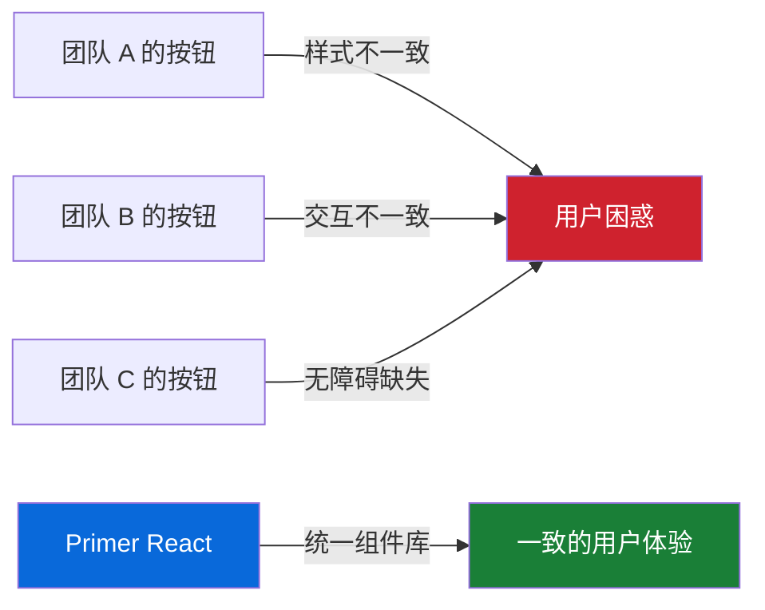
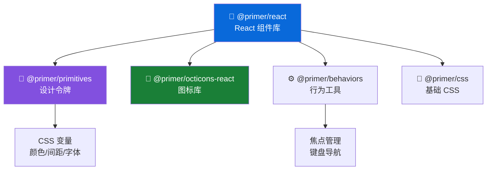

# 🚀 快速入门（Getting Started）

> 本篇目标：了解 Primer React 解决的核心问题、掌握安装和基础使用、熟悉项目结构。

---

## 📌 Primer React 解决了什么问题？

想象一个拥有数百个页面、数十个团队同时开发的产品——这就是 GitHub。当不同团队各自开发 UI 组件时，会面临这些问题：



**设计系统（Design System）** 就是解决这类问题的方案。你可以把它理解为一本"UI 字典"：

| 类比 | 设计系统 |
|------|---------|
| 📖 字典定义了词语的含义 | 设计系统定义了 UI 组件的样式和行为 |
| 📝 语法规则确保句子通顺 | 设计规范确保界面一致 |
| 🎨 字体风格让文字可读 | 设计令牌（Design Tokens）让界面美观 |

**Primer React** 就是 GitHub 的"UI 字典"，它提供：

- ✅ **60+ 生产就绪的组件**（按钮、表单、导航、对话框等）
- ✅ **完整的主题系统**（亮色/暗色/自动切换）
- ✅ **内置无障碍支持**（ARIA 属性、键盘导航、焦点管理）
- ✅ **TypeScript 完整类型定义**
- ✅ **CSS Modules 高性能样式方案**

---

## 🛠️ 安装与配置

### 前置要求

- Node.js 18+
- React 18+
- npm 或 yarn 或 pnpm

### 安装

```bash
# npm
npm install @primer/react

# yarn
yarn add @primer/react

# pnpm
pnpm add @primer/react
```

### 基础配置

使用 Primer React 的第一步是在应用根组件中包裹 `ThemeProvider`：

```tsx
// App.tsx
import {ThemeProvider, BaseStyles} from '@primer/react'

function App() {
  return (
    <ThemeProvider>
      <BaseStyles>
        {/* 你的应用内容 */}
        <MyPage />
      </BaseStyles>
    </ThemeProvider>
  )
}
```

**为什么需要这两个组件？**

| 组件 | 作用 | 类比 |
|------|------|------|
| `ThemeProvider` | 提供主题上下文（颜色、字体、间距等设计令牌） | 就像给整个应用"穿上统一的校服" |
| `BaseStyles` | 应用全局基础样式（重置浏览器默认样式） | 就像"铺好画布"再开始画画 |

### 第一个组件

```tsx
import {Button} from '@primer/react'

function MyPage() {
  return (
    <div>
      <h1>Hello Primer React!</h1>
      <Button variant="primary" onClick={() => alert('🎉')}>
        点击我
      </Button>
    </div>
  )
}
```

恭喜！你已经成功使用了第一个 Primer React 组件。

---

## 📂 项目结构全览

Primer React 采用 **Monorepo**（单一仓库）架构，使用 npm workspaces + Turbo 管理多个包：

```
primer-react/
├── 📂 packages/
│   ├── 📂 react/              # 🎯 核心包：所有 React 组件
│   │   ├── 📂 src/            # 源代码
│   │   │   ├── 📂 Button/     # 每个组件一个目录
│   │   │   ├── 📂 ActionList/ # 复合组件
│   │   │   ├── 📂 Dialog/     # 对话框
│   │   │   ├── 📂 hooks/      # 自定义 Hooks
│   │   │   ├── 📂 internal/   # 内部工具
│   │   │   ├── 📂 utils/      # 公共工具函数
│   │   │   └── index.ts       # 主入口文件
│   │   ├── package.json
│   │   └── rollup.config.mjs  # 构建配置
│   ├── 📂 styled-react/       # 旧版 styled-components 兼容包
│   ├── 📂 mcp/                # MCP 服务（AI 工具集成）
│   └── 📂 doc-gen/            # 文档生成工具
├── 📂 e2e/                    # 端到端测试（Playwright）
├── 📂 examples/               # 示例项目
│   ├── 📂 nextjs/             # Next.js 集成示例
│   ├── 📂 theming/            # 主题定制示例
│   └── 📂 codesandbox/        # CodeSandbox 模板
├── 📂 contributor-docs/       # 贡献者文档
│   ├── 📂 adrs/               # 架构决策记录（ADR）
│   ├── principles.md          # 设计原则
│   ├── testing.md             # 测试规范
│   └── authoring-css.md       # CSS 编写规范
├── package.json               # 根配置
└── turbo.json                 # Turbo 构建配置
```

### 核心包的组件目录结构

每个组件都遵循统一的文件组织规范：

```
Button/
├── index.ts                    # 导出入口
├── Button.tsx                  # 主组件实现
├── ButtonBase.tsx              # 基础组件（复用逻辑）
├── IconButton.tsx              # 变体：图标按钮
├── LinkButton.tsx              # 变体：链接按钮
├── types.ts                    # TypeScript 类型定义
├── Button.module.css           # CSS Modules 样式
├── ButtonBase.module.css       # 基础样式
├── Button.stories.tsx          # Storybook 故事
├── Button.features.stories.tsx # 功能特性展示
├── Button.docs.json            # 文档元数据
├── Button.figma.tsx            # Figma 集成
└── __tests__/                  # 测试目录
    ├── Button.test.tsx         # 单元测试
    └── Button.types.test.tsx   # 类型测试
```

**为什么这样组织？**

- **就近原则**：组件相关的代码、样式、测试、文档都放在一起，方便维护
- **一致性**：所有组件遵循相同结构，降低认知负担
- **可发现性**：文件名包含组件名前缀，IDE 中搜索更方便

---

## 🔧 开发环境搭建

如果你想参与 Primer React 的开发，或者在本地调试源码：

```bash
# 1. 克隆仓库
git clone https://github.com/primer/react.git
cd react

# 2. 安装依赖（约 2 分钟）
npm install

# 3. 构建项目（约 90 秒）
npm run build

# 4. 启动 Storybook 开发环境
npm start
# 访问 http://localhost:6006 查看所有组件
```

### 常用命令速查

| 命令 | 作用 | 预计耗时 |
|------|------|---------|
| `npm install` | 安装依赖 | ~5 秒（有缓存）/ ~2 分钟（首次） |
| `npm run build` | 构建所有包 | ~90 秒 |
| `npm start` | 启动 Storybook | ~3 秒 |
| `npm test` | 运行单元测试 | ~75 秒 |
| `npm run type-check` | TypeScript 类型检查 | ~42 秒 |
| `npm run lint` | 代码风格检查 | ~73 秒 |
| `npm run format` | 代码格式化 | 数秒 |

---

## 🧪 快速体验：几个常用组件

### 按钮（Button）

```tsx
import {Button, IconButton} from '@primer/react'
import {SearchIcon, PlusIcon} from '@primer/octicons-react'

function ButtonExamples() {
  return (
    <>
      {/* 基础按钮 */}
      <Button>默认按钮</Button>
      <Button variant="primary">主要按钮</Button>
      <Button variant="danger">危险按钮</Button>

      {/* 带图标的按钮 */}
      <Button leadingVisual={SearchIcon}>搜索</Button>
      <Button trailingVisual={PlusIcon}>新建</Button>

      {/* 图标按钮 */}
      <IconButton icon={SearchIcon} aria-label="搜索" />

      {/* 加载状态 */}
      <Button loading>提交中...</Button>

      {/* 不同尺寸 */}
      <Button size="small">小按钮</Button>
      <Button size="medium">中按钮</Button>
      <Button size="large">大按钮</Button>
    </>
  )
}
```

### 表单（Form）

```tsx
import {FormControl, TextInput, Select, Checkbox} from '@primer/react'

function FormExample() {
  return (
    <form>
      <FormControl>
        <FormControl.Label>用户名</FormControl.Label>
        <TextInput placeholder="输入用户名" />
        <FormControl.Caption>
          用户名将公开显示
        </FormControl.Caption>
      </FormControl>

      <FormControl>
        <FormControl.Label>角色</FormControl.Label>
        <Select>
          <Select.Option value="dev">开发者</Select.Option>
          <Select.Option value="designer">设计师</Select.Option>
        </Select>
      </FormControl>

      <FormControl>
        <Checkbox />
        <FormControl.Label>同意服务条款</FormControl.Label>
      </FormControl>
    </form>
  )
}
```

### 操作菜单（ActionMenu）

```tsx
import {ActionMenu, ActionList} from '@primer/react'
import {GearIcon} from '@primer/octicons-react'

function MenuExample() {
  return (
    <ActionMenu>
      <ActionMenu.Button>操作</ActionMenu.Button>
      <ActionMenu.Overlay>
        <ActionList>
          <ActionList.Item onSelect={() => console.log('编辑')}>
            编辑
          </ActionList.Item>
          <ActionList.Item onSelect={() => console.log('复制')}>
            复制
          </ActionList.Item>
          <ActionList.Divider />
          <ActionList.Item variant="danger" onSelect={() => console.log('删除')}>
            删除
          </ActionList.Item>
        </ActionList>
      </ActionMenu.Overlay>
    </ActionMenu>
  )
}
```

---

## 📚 关键模块说明

### 组件导出分层

Primer React 将组件分为四个层级，对应不同的稳定性和使用场景：

```tsx
// ✅ 稳定版组件（推荐使用）
import {Button, TextInput, Dialog} from '@primer/react'

// 🧪 实验性组件（API 可能变更）
import {FeatureComponent} from '@primer/react/experimental'

// ⚠️ 废弃组件（将被移除，请迁移）
import {LegacyComponent} from '@primer/react/deprecated'

// 🔄 下一代组件（正在替代旧版）
import {NextComponent} from '@primer/react/next'
```

| 层级 | 导入路径 | 说明 |
|------|---------|------|
| 稳定版 | `@primer/react` | 生产环境推荐使用 |
| 实验性 | `@primer/react/experimental` | 新组件试验阶段，API 可能变更 |
| 废弃 | `@primer/react/deprecated` | 已废弃，提供迁移期 |
| 下一代 | `@primer/react/next` | 正在替代旧版的新实现 |

### 核心依赖关系



- **`@primer/primitives`**：设计令牌的核心来源，定义了颜色、间距、字体等所有设计变量
- **`@primer/octicons-react`**：GitHub 官方图标库的 React 封装
- **`@primer/behaviors`**：行为工具集，提供焦点管理、键盘导航等无障碍功能
- **`@primer/css`**：基础 CSS 样式，提供重置样式和工具类

---

## ✅ 本章小结

通过本章，你应该：

- [x] 理解 Primer React 解决的核心问题（UI 一致性、可维护性、无障碍）
- [x] 完成安装和基础配置（ThemeProvider + BaseStyles）
- [x] 熟悉项目的 Monorepo 结构和组件目录规范
- [x] 能够使用基础组件（Button、FormControl、ActionMenu）
- [x] 了解组件的四个导出层级（稳定/实验/废弃/下一代）

---

## ➡️ 下一步

继续阅读 [02 - 核心概念](./02-core-concepts.md)，深入了解 Primer React 的主题系统、样式方案和组件分类体系。
