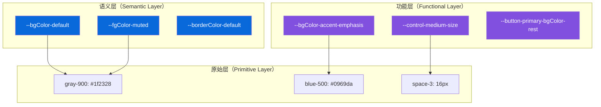
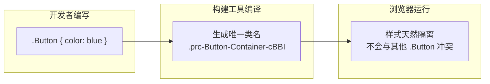

# 🧠 核心概念（Core Concepts）

> 本篇目标：深入理解 Primer React 的三大核心支柱——主题系统、样式方案和组件分类体系。

---

## 🎨 主题系统（Theming System）

### 为什么需要主题系统？

思考一个问题：如果你的应用需要支持亮色模式和暗色模式，你会怎么做？

**方案 A**（不推荐 ❌）：到处写条件判断

```tsx
// 🚫 每个组件都要判断
const bgColor = isDark ? '#0d1117' : '#ffffff'
const textColor = isDark ? '#f0f6fc' : '#1f2328'
```

**方案 B**（Primer 的做法 ✅）：使用设计令牌

```css
/* ✅ 使用语义化的 CSS 变量 */
.card {
  background-color: var(--bgColor-default);
  color: var(--fgColor-default);
}
/* 切换主题时，CSS 变量的值自动变化，无需修改组件代码 */
```

Primer React 的主题系统基于 **设计令牌（Design Tokens）** 实现，核心思想是：

> **将设计决策从代码中抽离出来，用语义化的变量名表达设计意图。**

### 设计令牌的三层架构



| 层级      | 说明           | 示例                            | 特点                           |
| --------- | -------------- | ------------------------------- | ------------------------------ |
| 🔵 语义层 | 表达"用途"     | `--bgColor-default`             | 与主题无关，切换主题时自动映射 |
| 🟣 功能层 | 表达"组件状态" | `--button-primary-bgColor-rest` | 组件级别的令牌                 |
| ⚪ 原始层 | 具体数值       | `gray-900: #1f2328`             | 主题特定的硬编码值             |

### ThemeProvider 使用详解

```tsx
import {ThemeProvider, BaseStyles} from '@primer/react'

function App() {
  return (
    <ThemeProvider
      colorMode="auto" // 'auto' | 'day' | 'night'
      dayScheme="light" // 亮色方案
      nightScheme="dark" // 暗色方案
      preventSSRMismatch // 防止 SSR 水合不匹配
    >
      <BaseStyles>
        <MyApp />
      </BaseStyles>
    </ThemeProvider>
  )
}
```

**colorMode 选项说明**：

| 值        | 行为                                   |
| --------- | -------------------------------------- |
| `'auto'`  | 跟随系统偏好（`prefers-color-scheme`） |
| `'day'`   | 强制使用 dayScheme                     |
| `'night'` | 强制使用 nightScheme                   |

**在组件中使用主题**：

```tsx
import {useTheme} from '@primer/react'

function MyComponent() {
  const {colorMode, setColorMode, colorScheme} = useTheme()

  return (
    <div>
      <p>当前模式: {colorMode}</p>
      <button onClick={() => setColorMode('night')}>切换到暗色</button>
    </div>
  )
}
```

### 主题在 DOM 上的体现

ThemeProvider 会在 DOM 元素上设置 `data-*` 属性，CSS 变量通过这些属性激活：

```html
<div data-color-mode="auto" data-light-theme="light" data-dark-theme="dark">
  <!-- CSS 变量在这里生效 -->
  <!-- 例如 --bgColor-default 在 light 主题下为 #ffffff -->
  <!-- 在 dark 主题下自动变为 #0d1117 -->
</div>
```

---

## 🎯 样式方案（Styling Approach）

### CSS Modules：Primer React 的样式选择

Primer React 从 styled-components（运行时 CSS）迁移到了 **CSS Modules**（编译时 CSS）。这是一个重要的架构决策。

#### 什么是 CSS Modules？



CSS Modules 是一种 CSS 文件约定：每个 `.module.css` 文件中的类名会被自动转换为唯一的字符串，从而避免样式冲突。

#### 为什么选择 CSS Modules？

| 维度                    | styled-components | CSS Modules        | 差距       |
| ----------------------- | ----------------- | ------------------ | ---------- |
| 初始渲染（1000 个组件） | 242ms             | 96ms               | 快 **60%** |
| SSR 渲染开销            | +450ms            | 0ms                | 快 **20%** |
| 动态样式更新            | 400ms             | 165ms              | 快 **60%** |
| 是否阻塞渲染            | 是（运行时注入）  | 否（预编译 CSS）   | -          |
| Bundle 大小影响         | 包含 runtime      | 纯 CSS，无 runtime | 更小       |

> **类比**：styled-components 像是"现场裁缝"——每次穿衣服都要现裁现做；CSS Modules 像是"成衣店"——衣服提前做好，穿上就走。

#### CSS Modules 在 Primer React 中的使用

**组件代码**：

```tsx
// Button.tsx
import classes from './Button.module.css'
import {clsx} from 'clsx'

function Button({variant = 'default', size = 'medium', className, children}) {
  return (
    <button className={clsx(classes.Button, className)} data-variant={variant} data-size={size}>
      {children}
    </button>
  )
}
```

**样式代码**：

```css
/* Button.module.css */
.Button {
  display: inline-flex;
  align-items: center;
  height: var(--control-medium-size);
  padding: 0 var(--control-medium-paddingInline-normal);
  font-size: var(--text-body-size-medium);
  border: var(--borderWidth-thin) solid var(--button-default-borderColor-rest);
  border-radius: var(--borderRadius-medium);
  color: var(--button-default-fgColor-rest);
  background-color: var(--button-default-bgColor-rest);
}

/* 使用 data 属性 + :where() 控制变体 */
.Button:where([data-variant='primary']) {
  color: var(--fgColor-onEmphasis);
  background-color: var(--bgColor-accent-emphasis);
}

.Button:where([data-size='small']) {
  height: var(--control-small-size);
  font-size: var(--text-body-size-small);
}
```

#### 关键样式约定

**1. PascalCase 类名**

```css
/* ✅ 推荐 */
.ButtonBase {
}
.LeadingVisual {
}

/* ❌ 不推荐 */
.button-base {
}
.leading-visual {
}
```

原因：避免 CSS 中需要转义的字符（如 `-`），同时与 React 组件命名风格保持一致。

**2. Data 属性控制变体**

```css
/* ✅ 使用 data 属性 */
.Button:where([data-variant='danger']) {
  color: var(--fgColor-danger);
}

/* ❌ 不使用额外的修饰类 */
.Button.Button--danger {
  color: var(--fgColor-danger);
}
```

使用 `:where()` 包裹选择器可以保持选择器特异性（Specificity）为 `(0, 1, 0)`，避免特异性战争。

**3. CSS Layers 分层**

```css
@layer primer.components.button {
  .Button {
    /* 所有样式放在 layer 中 */
  }
}
```

CSS Layers 确保 Primer 的样式不会意外覆盖应用的自定义样式。

---

## 🗂️ 组件分类体系

Primer React 的 60+ 组件可以按用途分为以下类别：

### 布局组件（Layout）

用于页面整体结构和空间分配。

| 组件              | 用途         | 示例场景            |
| ----------------- | ------------ | ------------------- |
| `PageLayout`      | 页面级布局   | 带侧边栏的页面      |
| `SplitPageLayout` | 分屏布局     | 左右分栏的详情页    |
| `Stack`           | 弹性堆叠布局 | 垂直/水平排列元素   |
| `PageHeader`      | 页面头部     | 标题 + 操作按钮区域 |

### 表单组件（Forms）

用于用户输入和数据收集。

| 组件                           | 用途                               |
| ------------------------------ | ---------------------------------- |
| `TextInput`                    | 文本输入框                         |
| `Textarea`                     | 多行文本输入                       |
| `Select`                       | 下拉选择                           |
| `Checkbox` / `Radio`           | 复选/单选                          |
| `CheckboxGroup` / `RadioGroup` | 复选/单选组                        |
| `FormControl`                  | 表单控件容器（标签 + 输入 + 提示） |
| `ToggleSwitch`                 | 开关切换                           |

### 按钮与操作（Buttons & Actions）

| 组件          | 用途         |
| ------------- | ------------ |
| `Button`      | 通用按钮     |
| `IconButton`  | 图标按钮     |
| `LinkButton`  | 链接样式按钮 |
| `ButtonGroup` | 按钮组       |

### 导航组件（Navigation）

| 组件           | 用途           |
| -------------- | -------------- |
| `NavList`      | 侧边导航列表   |
| `UnderlineNav` | 下划线标签导航 |
| `Breadcrumbs`  | 面包屑导航     |
| `TabNav`       | 标签页导航     |

### 叠加层组件（Overlays）

| 组件              | 用途                 |
| ----------------- | -------------------- |
| `Dialog`          | 对话框/模态框        |
| `ActionMenu`      | 操作菜单（下拉菜单） |
| `Tooltip`         | 工具提示             |
| `AnchoredOverlay` | 锚定浮层             |

### 列表与数据（Lists & Data）

| 组件                 | 用途             |
| -------------------- | ---------------- |
| `ActionList`         | 可操作列表       |
| `DataTable`          | 数据表格         |
| `TreeView`           | 树形视图         |
| `FilteredActionList` | 可筛选的操作列表 |

### 反馈组件（Feedback）

| 组件          | 用途       |
| ------------- | ---------- |
| `Banner`      | 横幅通知   |
| `Flash`       | 闪现消息   |
| `Spinner`     | 加载指示器 |
| `ProgressBar` | 进度条     |

### 展示组件（Display）

| 组件                     | 用途                    |
| ------------------------ | ----------------------- |
| `Avatar` / `AvatarStack` | 用户头像                |
| `Label` / `CounterLabel` | 标签/计数器             |
| `StateLabel`             | 状态标签（Open/Closed） |
| `RelativeTime`           | 相对时间展示            |
| `Blankslate`             | 空状态占位              |
| `Truncate`               | 文本截断                |

### 工具组件（Utility）

| 组件             | 用途                       |
| ---------------- | -------------------------- |
| `Box`            | 通用容器                   |
| `Text`           | 文本容器                   |
| `Heading`        | 标题                       |
| `Link`           | 链接                       |
| `VisuallyHidden` | 视觉隐藏（屏幕阅读器可见） |

---

## 🪝 自定义 Hooks

Primer React 提供了丰富的 Hooks 用于行为复用：

| Hook                  | 用途                             |
| --------------------- | -------------------------------- |
| `useTheme`            | 获取/修改主题配置                |
| `useResponsiveValue`  | 根据视口宽度返回不同值           |
| `useOverlay`          | 管理浮层的显示/隐藏              |
| `useFocusTrap`        | 焦点陷阱（焦点不会离开指定区域） |
| `useFocusZone`        | 焦点区域管理（方向键导航）       |
| `useAnchoredPosition` | 计算锚定元素的位置               |

### useResponsiveValue 示例

```tsx
import {useResponsiveValue} from '@primer/react'

function ResponsiveComponent() {
  // 根据屏幕宽度返回不同值
  const columns = useResponsiveValue(
    {narrow: 1, regular: 2, wide: 3},
    1, // 默认值
  )

  return <div style={{columns}}>...</div>
}
```

---

## 🔤 TypeScript 类型系统

Primer React 是用 TypeScript 编写的，提供完整的类型定义。

### 组件 Props 类型

```tsx
import type {ButtonProps} from '@primer/react'

// ButtonProps 包含：
// - variant: 'default' | 'primary' | 'danger' | 'link'
// - size: 'small' | 'medium' | 'large'
// - leadingVisual: React.ComponentType | React.ReactElement
// - loading: boolean
// - block: boolean
// ... 以及所有原生 <button> 属性
```

### 多态组件类型

部分组件支持 `as` prop，改变底层渲染的 HTML 元素：

```tsx
import {Button} from '@primer/react'
import {Link} from 'react-router-dom'

// Button 渲染为 <a> 标签
<Button as="a" href="/settings">设置</Button>

// Button 渲染为 React Router 的 Link
<Button as={Link} to="/settings">设置</Button>
```

TypeScript 会根据 `as` prop 的值自动推断可用的属性：

```tsx
// ✅ as="a" 时可以使用 href
<Button as="a" href="/settings">OK</Button>

// ❌ as="button" 时不能使用 href（类型错误）
<Button as="button" href="/settings">Error</Button>
```

---

## ✅ 本章小结

| 概念       | 核心要点                                                            |
| ---------- | ------------------------------------------------------------------- |
| 主题系统   | 基于 CSS 变量的三层设计令牌，支持亮/暗/自动模式                     |
| 样式方案   | CSS Modules（编译时）替代 styled-components（运行时），性能提升 60% |
| 组件分类   | 9 大类 60+ 组件，覆盖布局、表单、导航、叠加层等场景                 |
| Hooks      | 提供主题、响应式、焦点管理等行为复用能力                            |
| TypeScript | 完整类型定义，多态组件支持自动类型推断                              |

---

## ➡️ 下一步

继续阅读 [03 - 组件设计模式](./03-component-patterns.md)，学习 Primer React 中的复合组件模式、多态组件、Slot 模式等高级组件设计技巧。
