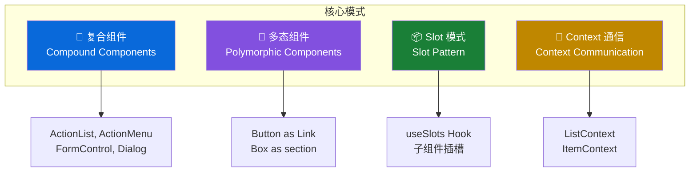
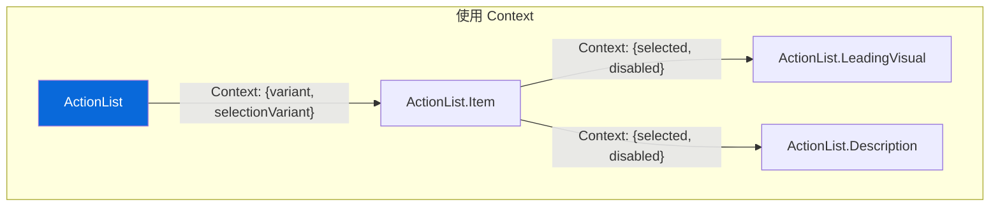

# 🧩 组件设计模式（Component Patterns）

> 本篇目标：掌握 Primer React 中使用的核心组件设计模式——复合组件、多态组件、Slot 模式和 Context 通信。

---

## 📐 设计模式总览

Primer React 在组件设计中大量使用了以下模式：



---

## 🧩 模式一：复合组件（Compound Components）

### 什么是复合组件？

复合组件是一组相互关联、共同工作的组件集合。它们各自负责一部分 UI，但组合在一起形成完整的功能。

**类比**：就像 HTML 的 `<select>` 和 `<option>` ——它们分别没有意义，组合起来才是完整的下拉选择器。

```tsx
{
  /* HTML 的复合模式 */
}
;<select>
  <option>选项 A</option>
  <option>选项 B</option>
</select>

{
  /* Primer React 的复合模式 */
}
;<ActionList>
  <ActionList.Item>选项 A</ActionList.Item>
  <ActionList.Item>选项 B</ActionList.Item>
</ActionList>
```

### 实际示例：ActionList

```tsx
<ActionList>
  <ActionList.Heading>用户操作</ActionList.Heading>

  <ActionList.Item>
    <ActionList.LeadingVisual>
      <Avatar src="avatar.png" />
    </ActionList.LeadingVisual>
    用户名
    <ActionList.Description>这是一段描述文字</ActionList.Description>
    <ActionList.TrailingVisual>
      <CounterLabel>12</CounterLabel>
    </ActionList.TrailingVisual>
  </ActionList.Item>

  <ActionList.Divider />

  <ActionList.Item variant="danger">
    <ActionList.LeadingVisual>
      <TrashIcon />
    </ActionList.LeadingVisual>
    删除
  </ActionList.Item>
</ActionList>
```

### 复合组件的实现原理

复合组件通常通过 **静态属性（Static Properties）** 挂载子组件：

```tsx
// 简化的实现示例
import {List} from './List'
import {Item} from './Item'
import {Divider} from './Divider'
import {LeadingVisual} from './LeadingVisual'
import {Description} from './Description'

// 将子组件挂载为静态属性
const ActionList = Object.assign(List, {
  Item,
  Divider,
  LeadingVisual,
  Description,
  // ...更多子组件
})

export {ActionList}
```

**为什么用 `Object.assign` 而不是 `ActionList.Item = Item`？**

`Object.assign` 创建了一个新对象，TypeScript 可以正确推断类型，而直接赋值可能导致类型丢失。

### 复合组件 vs Props 驱动

Primer React 同时使用两种 API 风格，选择取决于设计意图：

```tsx
{
  /* 复合组件风格：灵活、可组合 */
}
;<ActionList>
  <ActionList.Item>
    <ActionList.LeadingVisual>
      <SearchIcon />
    </ActionList.LeadingVisual>
    搜索
    <ActionList.Description>在仓库中搜索</ActionList.Description>
  </ActionList.Item>
</ActionList>

{
  /* Props 驱动风格：简洁、受控 */
}
;<Button variant="primary" leadingVisual={SearchIcon} size="medium">
  搜索
</Button>
```

**何时使用哪种风格？**

| 场景                   | 推荐风格   | 原因                 |
| ---------------------- | ---------- | -------------------- |
| 子元素结构灵活多变     | 复合组件   | 让使用者自由组合     |
| 组件结构固定、变体有限 | Props 驱动 | 简化使用、确保一致   |
| 列表/菜单类组件        | 复合组件   | 子项可能包含不同内容 |
| 按钮/标签类组件        | Props 驱动 | 结构简单明确         |

---

## 🔄 模式二：多态组件（Polymorphic Components）

### 什么是多态组件？

多态组件可以通过 `as` prop 改变底层渲染的 HTML 元素或 React 组件。

**类比**：就像一个演员可以扮演不同角色——同一个"按钮"组件，可以是 `<button>`、`<a>` 或 React Router 的 `<Link>`。

### 使用示例

```tsx
import {Button} from '@primer/react'
import {Link} from 'react-router-dom'

// 默认渲染为 <button>
<Button>点击</Button>

// 渲染为 <a>（外部链接）
<Button as="a" href="https://github.com">
  访问 GitHub
</Button>

// 渲染为 React Router Link（SPA 导航）
<Button as={Link} to="/settings">
  设置
</Button>
```

### 实现原理

多态组件的核心是 `forwardRef` + 泛型类型推断：

```tsx
import {forwardRef} from 'react'
import type {ForwardRefComponent} from '../utils/polymorphic'

// 简化的实现思路
type ButtonBaseProps = {
  variant?: 'default' | 'primary' | 'danger'
  size?: 'small' | 'medium' | 'large'
  children?: React.ReactNode
}

const ButtonBase = forwardRef(({as: Component = 'button', children, ...props}, ref) => {
  return (
    <Component ref={ref} {...props}>
      {children}
    </Component>
  )
}) as ForwardRefComponent<'button', ButtonBaseProps>
```

**关键点**：

1. `as` prop 默认值为 `'button'`，可以传入任何 HTML 标签名或 React 组件
2. `ForwardRefComponent` 类型确保 TypeScript 根据 `as` 的值推断可用属性
3. 使用 `forwardRef` 确保 ref 可以正确传递到底层元素

### 类型安全

多态组件的类型系统非常精巧：

```tsx
// ✅ as="a" 时，TypeScript 知道可以用 href
<Button as="a" href="/page">Link</Button>

// ✅ as="button" 时，TypeScript 知道可以用 type
<Button as="button" type="submit">Submit</Button>

// ❌ 类型错误：button 没有 href 属性
<Button as="button" href="/page">Error</Button>
```

---

## 📦 模式三：Slot 模式（Slot Pattern）

### 什么是 Slot 模式？

Slot 模式允许父组件从 `children` 中"提取"出特定的子组件，放置到指定位置。

**类比**：就像一封信——你写了内容（children），但信封（父组件）会自动把地址放在上方、邮票放在右上角。

### 使用示例

```tsx
<ActionList>
  <ActionList.Item>
    {/* LeadingVisual 被"提取"到左侧 */}
    <ActionList.LeadingVisual>
      <Avatar src="user.png" />
    </ActionList.LeadingVisual>
    {/* 文本内容放在中间 */}
    用户名
    {/* Description 被"提取"到文本下方 */}
    <ActionList.Description>这是一段描述</ActionList.Description>
    {/* TrailingVisual 被"提取"到右侧 */}
    <ActionList.TrailingVisual>⌘K</ActionList.TrailingVisual>
  </ActionList.Item>
</ActionList>
```

渲染结果的布局：

```
┌─────────────────────────────────────────┐
│  [头像]  用户名                    ⌘K   │
│          这是一段描述                    │
└─────────────────────────────────────────┘
```

### 实现原理：useSlots Hook

Primer React 使用自定义的 `useSlots` Hook 实现 Slot 模式：

```tsx
import {useSlots} from '../hooks/useSlots'

function Item({children, ...props}) {
  // 从 children 中提取指定的 Slot 组件
  const [slots, childrenWithoutSlots] = useSlots(children, {
    leadingVisual: LeadingVisual,
    description: Description,
    trailingVisual: TrailingVisual,
  })

  return (
    <li>
      {/* 将 slot 放到指定位置 */}
      <div className="leading">{slots.leadingVisual}</div>
      <div className="content">
        <span className="label">{childrenWithoutSlots}</span>
        {slots.description}
      </div>
      <div className="trailing">{slots.trailingVisual}</div>
    </li>
  )
}
```

**useSlots 的工作原理**：

1. 遍历 `children`，查找匹配指定组件类型的元素
2. 将匹配的元素"提取"出来，放入 `slots` 对象
3. 返回剩余的 `childrenWithoutSlots`（普通文本/非 Slot 元素）

**为什么不用 `React.Children` 或 `props.children` 直接操作？**

Primer React 的设计原则明确指出：

> **元素所有权原则**：React 元素的创建者（owner）拥有最高配置权。使用 `React.Children` 操作他人创建的元素会违反这一原则。

`useSlots` 只是"识别"和"归类"子元素，而不是"修改"它们。

---

## 🔗 模式四：Context 通信

### 为什么需要 Context？

在复合组件中，父组件和子组件之间需要共享状态。通过 Context 可以避免逐层传递 props。



### 实际示例：ActionList 的 Context 体系

ActionList 使用多层 Context 实现组件间通信：

```tsx
// 第一层：List Context（列表级配置）
const ListContext = React.createContext({
  variant: 'inset', // 列表变体
  selectionVariant: undefined, // 选择模式
  role: undefined, // ARIA role
})

// 第二层：Item Context（项目级状态）
const ItemContext = React.createContext({
  selected: false,
  disabled: false,
  inactive: false,
})
```

**在列表组件中提供 Context**：

```tsx
function List({variant, selectionVariant, children}) {
  const contextValue = React.useMemo(() => ({variant, selectionVariant}), [variant, selectionVariant])

  return (
    <ListContext.Provider value={contextValue}>
      <ul>{children}</ul>
    </ListContext.Provider>
  )
}
```

**在子组件中消费 Context**：

```tsx
function Item({children, selected, onSelect}) {
  // 从 ListContext 获取列表级配置
  const {selectionVariant} = React.useContext(ListContext)

  // 根据上下文推断 ARIA role
  let role
  if (selectionVariant === 'single') role = 'menuitemradio'
  else if (selectionVariant === 'multiple') role = 'menuitemcheckbox'
  else role = 'menuitem'

  return (
    <li role={role} aria-selected={selected}>
      {children}
    </li>
  )
}
```

### Context 的层级设计

```mermaid
graph TB
    subgraph 容器上下文
        CC[ActionListContainerContext<br/>container: 'ActionMenu' | 'SelectPanel']
    end

    subgraph 列表上下文
        LC[ListContext<br/>variant, selectionVariant, role]
    end

    subgraph 项目上下文
        IC[ItemContext<br/>selected, disabled, inactive]
    end

    CC --> LC --> IC

    style CC fill:#0969da,color:#fff
    style LC fill:#8250df,color:#fff
    style IC fill:#1a7f37,color:#fff
```

**为什么要分层？**

- **容器上下文**：告诉 ActionList 它在什么容器中（ActionMenu？SelectPanel？），以推断正确的语义
- **列表上下文**：传递列表级别的配置（变体、选择模式）
- **项目上下文**：传递单个列表项的状态（选中、禁用）

这种分层设计让每一层只关注自己需要的信息，符合**关注点分离（Separation of Concerns）** 原则。

---

## 🎯 模式五：Data Attributes 驱动变体

Primer React 使用 HTML `data-*` 属性来控制组件变体，而不是传统的 CSS 修饰类：

### 传统方式 vs Primer 方式

```tsx
{
  /* 传统方式：多个 CSS 类 */
}
;<button className="btn btn--primary btn--large btn--loading">提交</button>

{
  /* Primer 方式：data 属性 */
}
;<button className={classes.Button} data-variant="primary" data-size="large" data-loading>
  提交
</button>
```

### 对应的 CSS

```css
/* 使用 :where() 包裹，保持低特异性 */
.Button:where([data-variant='primary']) {
  background-color: var(--bgColor-accent-emphasis);
  color: var(--fgColor-onEmphasis);
}

.Button:where([data-size='large']) {
  height: var(--control-large-size);
  font-size: var(--text-body-size-large);
}

.Button:where([data-loading]) {
  cursor: default;
  pointer-events: none;
}
```

### 为什么选择 Data Attributes？

| 优势               | 说明                                                |
| ------------------ | --------------------------------------------------- |
| 📊 特异性可控      | `:where()` 将特异性归零，避免样式冲突               |
| 🎯 语义清晰        | `data-variant="primary"` 比 `btn--primary` 更具语义 |
| 🔧 调试友好        | 在 DevTools 中一目了然组件状态                      |
| 📋 CSS Layers 兼容 | 与 CSS Layers 方案完美配合                          |

---

## ✅ 本章小结

| 模式          | 核心思想                                      | 典型组件                          |
| ------------- | --------------------------------------------- | --------------------------------- |
| 复合组件      | 子组件通过静态属性挂载，组合使用              | ActionList, ActionMenu, Dialog    |
| 多态组件      | `as` prop 改变渲染元素类型                    | Button, Box, Link                 |
| Slot 模式     | useSlots 从 children 中提取特定组件到指定位置 | ActionList.Item                   |
| Context 通信  | 多层 Context 实现父子组件状态共享             | ActionList + Item + LeadingVisual |
| Data 属性变体 | `data-*` + `:where()` 控制组件状态样式        | 几乎所有组件                      |

---

## ➡️ 下一步

继续阅读 [04 - 高级架构](./04-advanced-architecture.md)，深入了解 CSS Modules 迁移策略、性能优化、SSR 支持和无障碍体系。
