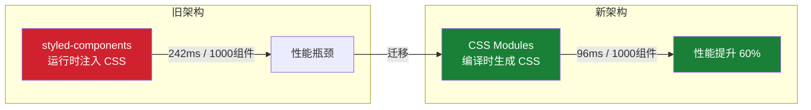
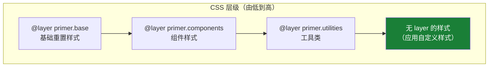
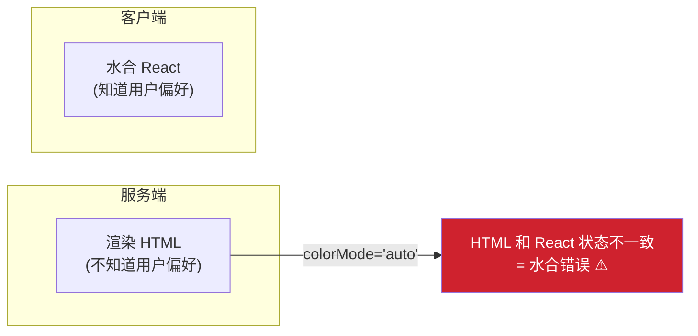
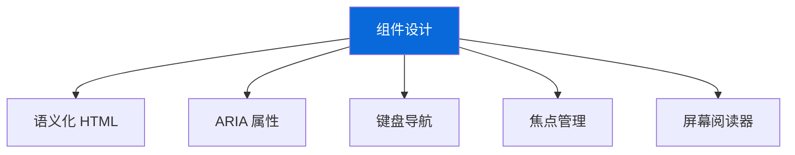
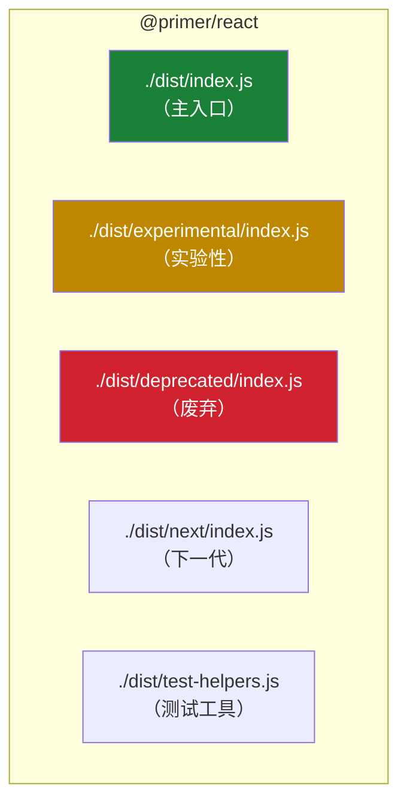
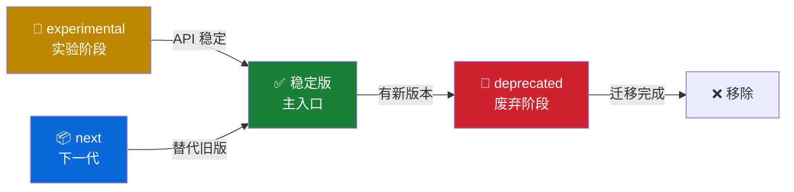

# 🏗️ 高级架构（Advanced Architecture）

> 本篇目标：深入理解 Primer React 的架构决策——CSS Modules 迁移策略、CSS Layers 体系、性能优化方案、SSR 支持和无障碍体系。

---

## 🎨 CSS Modules 迁移策略

### 迁移背景

Primer React 最初使用 **styled-components**（运行时 CSS-in-JS）来编写样式。随着 GitHub 规模的增长，性能瓶颈越来越明显。团队做了大量基准测试后，决定迁移到 **CSS Modules**。



### 迁移的核心挑战

| 挑战 | 解决方案 |
|------|---------|
| 旧代码大量使用 `sx` prop | 保持 `sx` prop 向后兼容，逐步废弃 |
| styled-components 的动态样式 | 使用 CSS 变量 + data 属性替代 |
| 第三方消费者依赖 styled API | 创建 `@primer/styled-react` 兼容包 |
| 渐进式迁移（不能一次全改） | 组件级别独立迁移，新旧共存 |

### 兼容层设计

为了平滑迁移，Primer React 设计了一个兼容层：

```
@primer/react          ← 新版（CSS Modules）
@primer/styled-react   ← 兼容层（保留 styled-components 行为）
```

**使用者的迁移路径**：

```tsx
// 阶段 1：使用旧版（styled-components）
import {Button} from '@primer/react'
<Button sx={{mt: 3, color: 'danger.fg'}}>删除</Button>

// 阶段 2：使用兼容层
import {Button} from '@primer/styled-react'
<Button sx={{mt: 3, color: 'danger.fg'}}>删除</Button>

// 阶段 3：迁移到 CSS Modules（推荐）
import {Button} from '@primer/react'
<Button variant="danger" className={myStyles.deleteButton}>删除</Button>
```

---

## 📐 CSS Layers 体系

### 为什么需要 CSS Layers？

CSS 最大的痛点之一是 **特异性（Specificity）战争**。当多个样式规则冲突时，浏览器根据选择器特异性决定哪个生效。

```css
/* 特异性：0,1,0 */
.button { color: blue; }

/* 特异性：0,2,0 — 覆盖上面的 */
.container .button { color: red; }

/* 特异性：1,0,0 — 覆盖上面的 */
#submit-btn { color: green; }
```

CSS Layers（`@layer`）提供了比特异性更上层的控制机制：



### Primer React 的 Layer 命名规范

```css
/* 组件样式放在对应的 layer 中 */
@layer primer.components.button {
  .Button {
    display: inline-flex;
    align-items: center;
    /* ... */
  }
}

@layer primer.components.actionList {
  .List {
    list-style: none;
    /* ... */
  }
}
```

**核心好处**：

1. **应用样式总是优先**：没有放在 `@layer` 中的样式（即应用自定义样式）永远高于 layer 内的样式
2. **组件间不冲突**：不同组件的 layer 相互独立
3. **可预测性**：样式覆盖顺序由 layer 顺序决定，而不是选择器特异性

### 实际效果

```css
/* Primer 组件样式（在 layer 中，低优先级） */
@layer primer.components.button {
  .Button { color: var(--button-default-fgColor-rest); }
}

/* 应用自定义样式（不在 layer 中，高优先级） */
.my-custom-button {
  color: purple; /* ✅ 自动覆盖 Primer 的样式 */
}
```

---

## ⚡ 性能优化

### 构建时优化

**CSS 类名作用域**：

```
/* 开发者写的 */
.Button { }

/* 构建后生成的 */
.prc-Button-Container-cBBI { }
```

命名规则：`prc-[组件目录]-[本地类名]-[hash:base64:5]`

| 部分 | 说明 |
|------|------|
| `prc` | Primer React Components 前缀 |
| 组件目录 | 来源组件的目录名 |
| 本地类名 | CSS Module 中定义的类名 |
| hash | 5 位 Base64 哈希，确保唯一 |

**Rollup 构建配置**：

Primer React 使用 Rollup 打包，关键优化包括：

- 多入口点拆分（main、experimental、deprecated、next）
- CSS Module 编译和合并
- React Compiler 集成（自动优化重新渲染）
- Tree-shaking 支持（只打包使用到的组件）

### 运行时优化

**1. useMemo 缓存 Context 值**

```tsx
// ✅ 正确：使用 useMemo 防止不必要的重新渲染
const contextValue = React.useMemo(
  () => ({variant, selectionVariant, role}),
  [variant, selectionVariant, role]
)

return <ListContext.Provider value={contextValue}>...</ListContext.Provider>
```

**2. React Compiler 集成**

Primer React 集成了 React Compiler（Babel 插件），自动为组件添加 memoization，减少不必要的重新渲染。

**3. 虚拟滚动**

对于长列表场景，使用 `@tanstack/react-virtual`：

```tsx
import {ActionList} from '@primer/react'

// DataTable 等组件内部使用虚拟滚动
// 只渲染可视区域内的行，性能与数据量无关
<DataTable data={hugeDataset} columns={columns} />
```

---

## 🌐 SSR 支持

### 服务端渲染的挑战

在 SSR 场景中，主要挑战是 **水合不匹配（Hydration Mismatch）**：



### 解决方案：Server Handoff

ThemeProvider 通过一个巧妙的"握手"机制解决这个问题：

```tsx
<ThemeProvider
  colorMode="auto"
  preventSSRMismatch  // 开启 SSR 兼容
>
  {children}
</ThemeProvider>
```

**工作原理**：

1. 服务端渲染时，ThemeProvider 注入一个隐藏的 `<script>` 标签，包含解析后的颜色模式
2. 客户端水合时，React 从这个 `<script>` 标签中读取服务端的状态
3. 使用服务端的状态作为初始值，避免不匹配

```html
<!-- 服务端渲染的 HTML -->
<div data-color-mode="auto" data-light-theme="light" data-dark-theme="dark">
  <!-- 隐藏的握手数据 -->
  <script type="application/json" id="__PRIMER_DATA_123__">
    {"resolvedServerColorMode": "day"}
  </script>
  <!-- 页面内容 -->
</div>
```

### SSR 兼容规范

Primer React 的所有组件都必须满足 SSR 兼容要求：

| 规则 | 说明 |
|------|------|
| ❌ 不能直接使用 `window`/`document` | 服务端没有 DOM API |
| ❌ 不能在 render 中访问 DOM | 使用 `useEffect` 延迟到客户端 |
| ⚠️ 谨慎使用 `useLayoutEffect` | SSR 时会产生警告 |
| ✅ 使用 CSS 变量做主题 | CSS 变量在服务端和客户端都能工作 |

---

## ♿ 无障碍体系（Accessibility）

### 设计原则

Primer React 的无障碍支持不是"事后补救"，而是从设计阶段就内置的：



### 语义化 ARIA 推断

ActionList 组件根据使用场景自动推断正确的 ARIA role：

```tsx
// 在 ActionMenu 中 → role="menuitem"
<ActionMenu>
  <ActionMenu.Button>操作</ActionMenu.Button>
  <ActionMenu.Overlay>
    <ActionList> {/* role="menu" */}
      <ActionList.Item> {/* role="menuitem" */}
        编辑
      </ActionList.Item>
    </ActionList>
  </ActionMenu.Overlay>
</ActionMenu>

// 单选模式 → role="menuitemradio"
<ActionMenu>
  <ActionMenu.Overlay>
    <ActionList selectionVariant="single">
      <ActionList.Item selected> {/* role="menuitemradio" */}
        选项 A
      </ActionList.Item>
    </ActionList>
  </ActionMenu.Overlay>
</ActionMenu>

// 独立使用 → role="listbox" + role="option"
<ActionList role="listbox">
  <ActionList.Item> {/* role="option" */}
    选项 A
  </ActionList.Item>
</ActionList>
```

### 焦点管理

**useFocusZone**：在列表类组件中，使用方向键导航：

```
┌──────────────────────────┐
│ ☰ 菜单项 A   ← 当前焦点  │  ↑ 向上移动
│ ☰ 菜单项 B               │
│ ☰ 菜单项 C               │  ↓ 向下移动
│ ☰ 菜单项 D               │
└──────────────────────────┘
   Enter = 选择    Escape = 关闭
```

**useFocusTrap**：在对话框等组件中，焦点不会离开组件区域：

```
┌───────────────── Dialog ─────────────────┐
│                                          │
│  标题                                     │
│                                          │
│  ┌─ TextInput ─────────┐  ← Tab 循环     │
│  └─────────────────────┘                 │
│                                          │
│  [取消]  [确认]  ← Tab 焦点到这里后       │
│                    再按 Tab 回到 TextInput │
└──────────────────────────────────────────┘
  焦点被"困"在 Dialog 内部，不会跑到背后的页面
```

### VisuallyHidden 组件

用于向屏幕阅读器传达信息，但不在视觉上显示：

```tsx
import {VisuallyHidden, IconButton} from '@primer/react'
import {XIcon} from '@primer/octicons-react'

// 图标按钮需要文字说明
<IconButton icon={XIcon} aria-label="关闭对话框" />

// 或者使用 VisuallyHidden
<button>
  <XIcon />
  <VisuallyHidden>关闭对话框</VisuallyHidden>
</button>
```

### 无障碍测试

Primer React 使用自动化工具确保无障碍合规：

```tsx
// 单元测试中使用 axe-core
import {checkStoriesForAxeViolations} from '../utils/testing'

// 自动检查所有 Storybook stories 的无障碍违规
checkStoriesForAxeViolations('Button')
checkStoriesForAxeViolations('ActionList')
```

**端到端测试**：

```typescript
// e2e/components/Button.test.ts
test('Button @avt', async ({page}) => {
  // 渲染组件
  await visit(page, {id: 'components-button--default'})
  // 运行 axe 无障碍检查
  await expect(page).toHaveNoViolations()
})
```

---

## 📦 模块导出架构

### 多入口点设计



**package.json 配置**：

```json
{
  "exports": {
    ".": "./dist/index.js",
    "./experimental": "./dist/experimental/index.js",
    "./deprecated": "./dist/deprecated/index.js",
    "./next": "./dist/next/index.js",
    "./test-helpers": "./dist/test-helpers.js",
    "./generated/components.json": "./generated/components.json"
  }
}
```

### 组件生命周期



---

## ✅ 本章小结

| 架构决策 | 核心思想 | 收益 |
|---------|---------|------|
| CSS Modules 迁移 | 编译时 CSS 替代运行时注入 | 性能提升 60%，SSR 友好 |
| CSS Layers | 层级化的样式优先级控制 | 消除特异性战争 |
| Server Handoff | 脚本标签传递服务端状态 | 解决 SSR 水合不匹配 |
| ARIA 自动推断 | Context 驱动的语义化标记 | 内置无障碍，降低使用门槛 |
| 多入口点 | 分层导出不同成熟度的组件 | 清晰的生命周期管理 |

---

## ➡️ 下一步

继续阅读 [05 - 源码深度解析](./05-source-code-deep-dive.md)，深入分析 Primer React 的关键源码实现、设计模式和"为什么这样设计"的推理过程。
