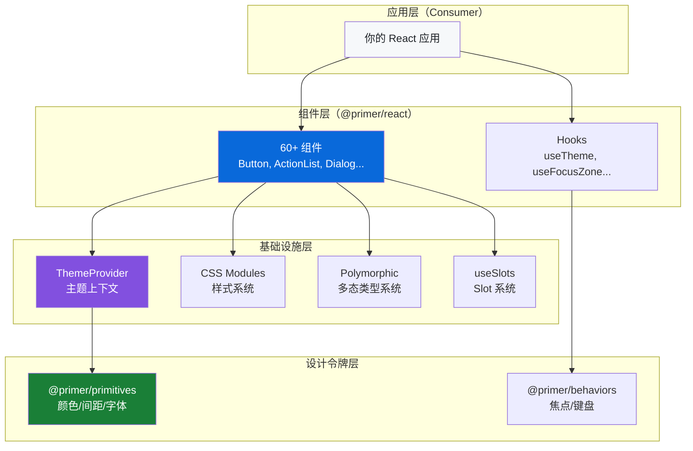
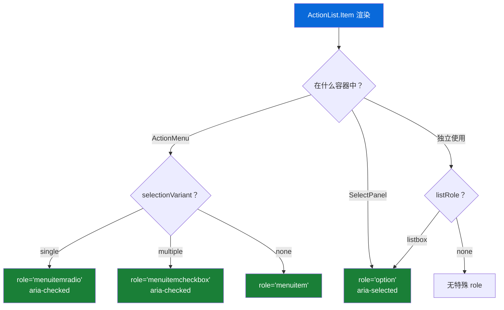

# 🔬 源码深度解析（Source Code Deep Dive）

> 本篇目标：深入分析 Primer React 的关键源码实现，理解设计模式和架构推理——不仅知道"是什么"，更要理解"为什么"。

---

## 🏛️ 总体架构

在深入源码之前，先建立对整体架构的宏观理解：



---

## 📖 源码解析一：ThemeProvider

**文件位置**：`packages/react/src/ThemeProvider.tsx`

ThemeProvider 是 Primer React 的"心脏"，所有组件都依赖它提供的主题上下文。

### 核心实现

```tsx
// 简化的 ThemeProvider 实现
export const ThemeProvider: React.FC<ThemeProviderProps> = ({
  colorMode: colorModeProp = 'day',
  dayScheme = 'light',
  nightScheme = 'dark',
  preventSSRMismatch = false,
  children,
}) => {
  // 1. 使用 useSyncedState 同步外部控制和内部状态
  const [colorMode, setColorMode] = useSyncedState(colorModeProp)
  const [dayScheme, setDayScheme] = useSyncedState(daySchemeFromProp)
  const [nightScheme, setNightScheme] = useSyncedState(nightSchemeFromProp)

  // 2. 监听系统颜色偏好
  const systemColorMode = useSystemColorMode()
  
  // 3. 解析实际使用的颜色模式
  const resolvedColorMode = resolveColorMode(colorMode, systemColorMode)
  const resolvedColorScheme = resolvedColorMode === 'day' ? dayScheme : nightScheme
  
  // 4. 生成 Context 值
  const contextValue = useMemo(
    () => ({
      colorMode, setColorMode,
      dayScheme, setDayScheme,
      nightScheme, setNightScheme,
      resolvedColorMode, resolvedColorScheme,
      theme: deepmerge(defaultTheme, {colorSchemes: ...}),
    }),
    [colorMode, dayScheme, nightScheme, resolvedColorMode]
  )
  
  return (
    <ThemeContext.Provider value={contextValue}>
      <div
        data-color-mode={colorMode === 'auto' ? 'auto' : resolvedColorMode}
        data-light-theme={dayScheme}
        data-dark-theme={nightScheme}
      >
        {children}
        {/* SSR 握手脚本 */}
        {preventSSRMismatch && (
          <script
            type="application/json"
            id={`__PRIMER_DATA_${id}__`}
            dangerouslySetInnerHTML={{
              __html: JSON.stringify({resolvedServerColorMode})
            }}
          />
        )}
      </div>
    </ThemeContext.Provider>
  )
}
```

### 关键设计决策分析

**决策 1：为什么用 `data-*` 属性而不是 CSS class？**

```html
<!-- Primer 的做法 -->
<div data-color-mode="auto" data-light-theme="light" data-dark-theme="dark">

<!-- 而不是 -->
<div class="theme-auto light-theme-light dark-theme-dark">
```

**原因**：
- `data-*` 属性具有语义性，表达的是"数据"而不是"样式"
- CSS 变量的激活规则由 `@primer/primitives` 定义，通过 `[data-color-mode]` 选择器匹配
- 与 CSS Layers 配合更好——属性选择器的特异性一致且可预测

**决策 2：为什么用 `dangerouslySetInnerHTML` 注入 SSR 数据？**

```tsx
<script
  type="application/json"
  dangerouslySetInnerHTML={{__html: JSON.stringify(data)}}
/>
```

**原因**：
- `type="application/json"` 的 `<script>` 不会被浏览器执行，安全性有保障
- JSON 序列化确保数据格式正确
- 嵌入在 React 树中，随组件一起服务端渲染
- 客户端水合时可以通过 `document.getElementById` 快速读取

**决策 3：为什么用 `deepmerge` 合并主题？**

```tsx
const theme = deepmerge(defaultTheme, customTheme)
```

**原因**：
- 支持主题的局部覆盖（只改变需要的部分）
- 嵌套的 ThemeProvider 可以继承并扩展父级主题
- 深合并确保嵌套对象不会被浅拷贝覆盖

---

## 📖 源码解析二：Button 组件

**文件位置**：`packages/react/src/Button/ButtonBase.tsx`

Button 是使用频率最高的组件之一，它的实现展示了 Primer React 的多个核心模式。

### 简化的核心实现

```tsx
const ButtonBase = forwardRef(
  (
    {
      children,
      as: Component = 'button',
      variant = 'default',
      size = 'medium',
      leadingVisual: LeadingVisual,
      trailingVisual: TrailingVisual,
      trailingAction: TrailingAction,
      count,
      loading,
      loadingAnnouncement = 'Loading',
      block,
      inactive,
      className,
      ...rest
    },
    forwardedRef,
  ) => {
    const innerRef = useRef<HTMLElement>(null)
    const ref = useMergedRefs(innerRef, forwardedRef)
    
    // 构建 aria 属性
    const ariaProps = loading
      ? {'aria-disabled': true, 'aria-busy': true}
      : inactive
        ? {'aria-disabled': true}
        : {}
    
    return (
      <Component
        ref={ref}
        className={clsx(classes.ButtonBase, className)}
        data-variant={variant}
        data-size={size}
        data-block={block || undefined}
        data-loading={loading || undefined}
        data-inactive={inactive || undefined}
        {...ariaProps}
        {...rest}
      >
        {/* 加载指示器 */}
        {loading && (
          <span className={classes.LoadingSpinner}>
            <Spinner size="small" />
          </span>
        )}
        
        {/* 按钮内容 */}
        <span className={classes.Content} aria-hidden={loading ? 'true' : undefined}>
          {/* 前置图标 */}
          {LeadingVisual && (
            <span className={classes.Visual}>
              {isElement(LeadingVisual)
                ? LeadingVisual
                : <LeadingVisual />}
            </span>
          )}
          
          {/* 按钮文本 */}
          <span className={classes.Label}>{children}</span>
          
          {/* 计数 */}
          {count !== undefined && (
            <span className={classes.Count}>
              <CounterLabel>{count}</CounterLabel>
            </span>
          )}
          
          {/* 后置图标 */}
          {TrailingVisual && (
            <span className={classes.Visual}>
              {isElement(TrailingVisual)
                ? TrailingVisual
                : <TrailingVisual />}
            </span>
          )}
        </span>
        
        {/* 加载中的无障碍提示 */}
        {loading && (
          <VisuallyHidden>{loadingAnnouncement}</VisuallyHidden>
        )}
      </Component>
    )
  }
)
```

### 设计模式分析

**模式 1：ComponentType 和 ReactElement 的双重支持**

```tsx
// 使用者可以传入组件类型
<Button leadingVisual={SearchIcon}>搜索</Button>

// 也可以传入组件实例
<Button leadingVisual={<SearchIcon size={16} />}>搜索</Button>
```

实现方式：

```tsx
{isElement(LeadingVisual)
  ? LeadingVisual                    // 已经是 ReactElement，直接渲染
  : <LeadingVisual />}              // 是 ComponentType，需要实例化
```

**为什么这样设计？**
- ComponentType（`SearchIcon`）更简洁，适合大多数场景
- ReactElement（`<SearchIcon size={16} />`）提供更多控制权
- 两种方式都支持，让使用者选择更适合的写法

**模式 2：useMergedRefs 合并多个 Ref**

```tsx
const innerRef = useRef<HTMLElement>(null)
const ref = useMergedRefs(innerRef, forwardedRef)
```

**为什么需要合并？**
- 组件内部需要 `innerRef` 来操作 DOM（如测量尺寸）
- 外部使用者通过 `forwardedRef` 也需要访问 DOM
- `useMergedRefs` 创建一个代理 ref，同时更新两个目标

**模式 3：加载状态的无障碍处理**

```tsx
{loading && (
  <>
    <span aria-hidden="true"><Spinner /></span>
    <VisuallyHidden>{loadingAnnouncement}</VisuallyHidden>
  </>
)}
<span aria-hidden={loading ? 'true' : undefined}>
  {children}
</span>
```

**为什么这样处理？**
- 加载时，原始内容对屏幕阅读器隐藏（`aria-hidden="true"`）
- 同时提供 `VisuallyHidden` 文字告知屏幕阅读器"正在加载"
- Spinner 动画也对屏幕阅读器隐藏（纯视觉反馈）

---

## 📖 源码解析三：ActionList 的 ARIA 推断

**文件位置**：`packages/react/src/ActionList/Item.tsx`

这是 Primer React 中最精巧的无障碍设计之一。

### 自动 Role 推断逻辑

```tsx
function inferItemRole(container, selectionVariant, listRole) {
  // 场景 1：在 ActionMenu 中使用
  if (container === 'ActionMenu') {
    if (selectionVariant === 'single') return 'menuitemradio'
    if (selectionVariant === 'multiple') return 'menuitemcheckbox'
    return 'menuitem'
  }
  
  // 场景 2：在 SelectPanel 中使用
  if (container === 'SelectPanel') {
    return 'option'
  }
  
  // 场景 3：列表设置了 listbox role
  if (listRole === 'listbox') {
    return 'option'
  }
  
  // 场景 4：独立使用
  return undefined
}
```

### 上下文驱动的决策流



**为什么这样设计？**

1. **使用者不需要关心 ARIA**：开发者只需要使用 `<ActionList.Item>`，正确的 `role` 和 `aria-*` 属性会自动设置
2. **同一个组件，不同的语义**：ActionList.Item 在不同容器中表现为不同的 ARIA 角色
3. **减少错误**：手动设置 ARIA 属性容易出错，自动推断更可靠

---

## 📖 源码解析四：CSS Module 的类名生成

**文件位置**：`packages/react/rollup.config.mjs`

### 类名生成规则

```javascript
// Rollup 配置中的 CSS Modules 处理
css({
  modules: {
    generateScopedName: (name, filename) => {
      // 从文件路径提取组件目录名
      const dir = path.basename(path.dirname(filename))
      // 生成哈希
      const hash = createHash(name + filename)
      // 拼接最终类名
      return `prc-${dir}-${name}-${hash}`
    }
  }
})
```

### 实际转换效果

```
📄 Button/ButtonBase.module.css
.ButtonBase → .prc-Button-ButtonBase-abc12
.Content   → .prc-Button-Content-def34
.Visual    → .prc-Button-Visual-ghi56

📄 ActionList/ActionList.module.css
.List      → .prc-ActionList-List-jkl78
.Item      → .prc-ActionList-Item-mno90
```

**为什么使用 PascalCase？**

```css
/* ✅ PascalCase — 无需转义 */
.ButtonBase { }

/* ❌ kebab-case — 在 JS 对象中需要方括号访问 */
classes['button-base']
/* 而 PascalCase 可以直接用点号访问 */
classes.ButtonBase
```

---

## 📖 源码解析五：useSlots 的实现

### 简化的实现逻辑

```tsx
function useSlots(children, slotConfig) {
  const slots = {}
  const rest = []
  
  React.Children.forEach(children, child => {
    // 检查每个 child 是否匹配某个 slot
    for (const [slotName, SlotComponent] of Object.entries(slotConfig)) {
      if (React.isValidElement(child) && child.type === SlotComponent) {
        slots[slotName] = child
        return // 匹配到了，不放入 rest
      }
    }
    // 没有匹配任何 slot，放入剩余列表
    rest.push(child)
  })
  
  return [slots, rest]
}
```

### 使用场景

```tsx
function ActionListItem({children}) {
  const [slots, otherChildren] = useSlots(children, {
    leadingVisual: ActionList.LeadingVisual,
    trailingVisual: ActionList.TrailingVisual,
    description: ActionList.Description,
  })
  
  return (
    <li>
      {slots.leadingVisual}   {/* 放在左侧 */}
      <span>{otherChildren}</span>  {/* 放在中间 */}
      {slots.trailingVisual}  {/* 放在右侧 */}
      {slots.description}     {/* 放在文本下方 */}
    </li>
  )
}
```

**为什么不直接约定 children 的顺序？**

```tsx
// ❌ 如果靠顺序约定，使用者必须记住位置
<Item>
  <Icon />        {/* 第一个 = 左侧图标 */}
  文字内容          {/* 第二个 = 主文本 */}
  <Description />  {/* 第三个 = 描述 */}
  <Badge />        {/* 第四个 = 右侧标记 */}
</Item>

// ✅ 使用 Slot，位置由类型决定，顺序无关
<Item>
  <Description>描述</Description>  {/* 无论放在哪里 */}
  <LeadingVisual><Icon /></LeadingVisual>
  文字内容
  <TrailingVisual><Badge /></TrailingVisual>
</Item>
```

Slot 模式让组件的子元素布局与书写顺序解耦，更加灵活和健壮。

---

## 🎯 总结：核心设计模式一览

| 设计模式 | 应用场景 | 核心代码 | 设计哲学 |
|---------|---------|---------|---------|
| Context 分层 | 复合组件状态共享 | `ListContext` → `ItemContext` | 关注点分离 |
| Data 属性变体 | 组件状态/变体控制 | `data-variant`, `:where()` | 可预测的特异性 |
| 多态 forwardRef | 灵活的元素类型 | `as` prop + `ForwardRefComponent` | 组合优于继承 |
| Slot 提取 | 子组件位置管理 | `useSlots` | 声明式布局 |
| Ref 合并 | 内外 ref 共存 | `useMergedRefs` | 透明的 ref 转发 |
| SSR Handoff | 服务端状态传递 | `<script type="json">` | 渐进增强 |
| ARIA 推断 | 无障碍自动化 | Context-based role inference | 内置可访问性 |

---

## ✅ 本章小结

通过源码分析，我们理解了 Primer React 的关键设计决策：

1. **ThemeProvider** 通过 CSS 变量 + data 属性实现主题切换，SSR Handoff 解决水合问题
2. **Button** 展示了多态组件、Visual 双重支持、加载状态无障碍处理
3. **ActionList** 展示了 Context 驱动的 ARIA 自动推断，是无障碍设计的典范
4. **CSS Modules** 通过 PascalCase + 哈希确保类名唯一且开发体验友好
5. **useSlots** 实现了位置无关的子组件布局，提高了 API 的灵活性

---

## ➡️ 下一步

继续阅读 [06 - 实战指南](./06-practice-guide.md)，学习如何在实际项目中使用 Primer React，包括常见场景、最佳实践和问题排查。
