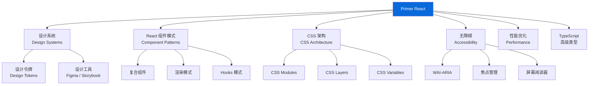
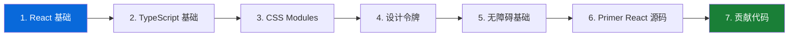

# 📚 扩展学习（Further Learning）

> 本篇目标：梳理与 Primer React 相关的知识体系，提供延伸阅读资源，帮助你建立更完整的前端设计系统知识图谱。

---

## 🗺️ 知识图谱

Primer React 涉及多个前端领域的深度知识。以下是一张关联知识图谱：



---

## 📖 相关知识点详解

### 1. 设计系统（Design Systems）

设计系统不仅仅是组件库。它是一套完整的设计语言、原则、模式和工具的集合。

**推荐学习资源**：

| 资源                 | 说明                    | 链接                                                       |
| -------------------- | ----------------------- | ---------------------------------------------------------- |
| Primer Design System | GitHub 官方设计系统文档 | [primer.style](https://primer.style)                       |
| Material Design      | Google 的设计系统       | [material.io](https://material.io)                         |
| Ant Design           | 蚂蚁集团的设计系统      | [ant.design](https://ant.design)                           |
| Design Systems Book  | Alla Kholmatova 著      | [designsystemsbook.com](https://www.designsystemsbook.com) |

**核心概念**：

- **设计令牌（Design Tokens）**：最小的设计决策单元（颜色、间距、字体）
- **组件（Components）**：可复用的 UI 构建块
- **模式（Patterns）**：组件组合的常见方式
- **指导原则（Guidelines）**：使用规范和最佳实践

### 2. CSS 现代架构

Primer React 使用的 CSS 技术代表了现代 CSS 的最佳实践。

**CSS Modules**：

- 局部作用域的 CSS 类名
- 编译时解析，运行时零开销
- 与框架无关（React、Vue、Svelte 都支持）

**CSS Layers（@layer）**：

- 层级化的样式优先级管理
- 解决大型项目的特异性（Specificity）问题
- 浏览器原生支持（Baseline 2022）

**CSS Custom Properties（CSS 变量）**：

- 运行时可变的样式值
- 支持主题切换、响应式设计
- 可通过 JavaScript 动态修改

**推荐阅读**：

| 资源                                                                                               | 说明                |
| -------------------------------------------------------------------------------------------------- | ------------------- |
| [CSS Modules 官方文档](https://github.com/css-modules/css-modules)                                 | CSS Modules 规范    |
| [MDN CSS Layers](https://developer.mozilla.org/en-US/docs/Web/CSS/@layer)                          | CSS @layer 完整指南 |
| [CSS Variables 指南](https://developer.mozilla.org/en-US/docs/Web/CSS/Using_CSS_custom_properties) | CSS 自定义属性      |

### 3. React 高级模式

Primer React 中使用的组件模式是 React 社区的最佳实践。

| 模式         | Primer 中的应用            | 进一步学习                          |
| ------------ | -------------------------- | ----------------------------------- |
| 复合组件     | ActionList, ActionMenu     | Kent C. Dodds 的高级 React 模式课程 |
| 多态组件     | Button `as` prop           | Radix UI 的多态实现                 |
| Context 模式 | ThemeProvider, ListContext | React 官方文档 useContext           |
| forwardRef   | 所有组件                   | React 官方文档 forwardRef           |
| 受控/非受控  | FormControl, TextInput     | React 官方文档表单                  |
| Render Props | 部分高级组件               | React 设计模式合集                  |

### 4. 无障碍（Accessibility）

Primer React 的无障碍实现是业界领先水平。

**WAI-ARIA 核心概念**：

| 概念        | 说明           | Primer 示例                      |
| ----------- | -------------- | -------------------------------- |
| Role        | 元素的语义角色 | `role="menu"`, `role="option"`   |
| State       | 元素的当前状态 | `aria-selected`, `aria-expanded` |
| Property    | 元素的属性     | `aria-label`, `aria-describedby` |
| Live Region | 动态内容通知   | `aria-live="polite"`             |

**推荐阅读**：

| 资源                                                                                             | 说明                              |
| ------------------------------------------------------------------------------------------------ | --------------------------------- |
| [WAI-ARIA 实践指南](https://www.w3.org/WAI/ARIA/apg/)                                            | W3C 官方 ARIA 模式库              |
| [axe-core 规则列表](https://github.com/dequelabs/axe-core/blob/develop/doc/rule-descriptions.md) | 自动化无障碍检查规则              |
| [Inclusive Components](https://inclusive-components.design)                                      | Heydon Pickering 的无障碍组件设计 |

### 5. TypeScript 高级类型

Primer React 中使用了一些高级 TypeScript 技巧。

**多态组件类型**：

```tsx
// 简化版的 ForwardRefComponent 类型
type ForwardRefComponent<DefaultElement extends React.ElementType, Props = {}> = {
  <Element extends React.ElementType = DefaultElement>(
    props: {as?: Element} & Props & React.ComponentPropsWithRef<Element>,
  ): React.ReactElement | null
}
```

**条件类型推断**：

```tsx
// 根据 as 的值推断可用的 props
type PolymorphicProps<E extends React.ElementType, P = {}> = P & Omit<React.ComponentPropsWithRef<E>, keyof P>
```

**推荐阅读**：

| 资源                                                                  | 说明                 |
| --------------------------------------------------------------------- | -------------------- |
| [TypeScript Handbook](https://www.typescriptlang.org/docs/handbook/)  | 官方 TypeScript 手册 |
| [Type Challenges](https://github.com/type-challenges/type-challenges) | TypeScript 类型挑战  |

---

## 🔗 Primer 生态系统

### 相关项目

| 项目                 | 说明                         | 链接                                                                 |
| -------------------- | ---------------------------- | -------------------------------------------------------------------- |
| `@primer/primitives` | 设计令牌（颜色、间距、字体） | [github.com/primer/primitives](https://github.com/primer/primitives) |
| `@primer/octicons`   | GitHub 图标库                | [github.com/primer/octicons](https://github.com/primer/octicons)     |
| `@primer/css`        | Primer CSS 框架              | [github.com/primer/css](https://github.com/primer/css)               |
| `@primer/behaviors`  | 行为工具集                   | 内置在 React 包中                                                    |
| `@primer/figma`      | Figma 组件库                 | Figma Community                                                      |

### 架构决策记录（ADR）

Primer React 的所有重要技术决策都记录在 ADR 中。推荐阅读：

| ADR     | 主题         | 要点                                    |
| ------- | ------------ | --------------------------------------- |
| ADR-003 | Props 规范   | 所有组件必须接受 `sx` 和 `ref`          |
| ADR-004 | Children API | 何时用 children vs props 驱动           |
| ADR-007 | 实验性组件   | 组件的生命周期管理                      |
| ADR-013 | 文件结构     | 组件目录的统一规范                      |
| ADR-016 | CSS 方案     | 从 styled-components 迁移到 CSS Modules |
| ADR-021 | CSS Layers   | 层级化样式管理                          |

这些 ADR 位于 `contributor-docs/adrs/` 目录中。

---

## 🎓 学习建议

### 如果你想贡献代码

1. 阅读 `contributor-docs/CONTRIBUTING.md`
2. 了解 `contributor-docs/testing.md` 中的测试规范
3. 熟悉 `contributor-docs/authoring-css.md` 中的 CSS 编写规范
4. 查看 `contributor-docs/principles.md` 了解设计原则

### 如果你想建设自己的设计系统

从 Primer React 中可以学到的核心思想：

1. **设计令牌先行**：先定义设计变量，再写组件
2. **CSS 变量驱动主题**：一次编写组件 CSS，通过变量切换主题
3. **编译时样式**：CSS Modules 优于运行时 CSS-in-JS
4. **无障碍内置**：从设计阶段就考虑无障碍，而不是事后补救
5. **渐进式架构**：支持实验性→稳定→废弃的组件生命周期
6. **ADR 记录决策**：用文档记录"为什么"，而不仅仅是"是什么"

### 推荐学习顺序



---

## 🌐 社区与支持

| 渠道                                                              | 用途               |
| ----------------------------------------------------------------- | ------------------ |
| [GitHub Discussions](https://github.com/primer/react/discussions) | 提问和讨论         |
| [GitHub Issues](https://github.com/primer/react/issues)           | Bug 报告和功能请求 |
| [Primer 官网](https://primer.style)                               | 完整的设计系统文档 |
| [Storybook](https://primer.style/react/storybook)                 | 在线组件交互演示   |

---

## ✅ 全系列总结

恭喜你完成了 Primer React 前端开发者学习路线的全部内容！

回顾一下你学到了什么：

| 章节        | 核心收获                               |
| ----------- | -------------------------------------- |
| 01 快速入门 | 安装配置、项目结构、基础组件           |
| 02 核心概念 | 主题系统、CSS Modules、组件分类        |
| 03 组件模式 | 复合组件、多态组件、Slot 模式          |
| 04 高级架构 | CSS Layers、SSR、无障碍体系            |
| 05 源码解析 | ThemeProvider、Button、ActionList 源码 |
| 06 实战指南 | 常见场景、最佳实践、问题排查           |
| 07 扩展学习 | 知识图谱、延伸阅读、学习建议           |

> 🎯 **最终目标**：不仅能使用 Primer React，更能理解它背后的设计思想，并将这些思想应用到你自己的项目中。

---

## ⬅️ 返回导航

- [📖 学习导航（README）](../README.md)
- [🎨 UI 设计师学习路线](../ui-designer/01-design-system-fundamentals.md)
