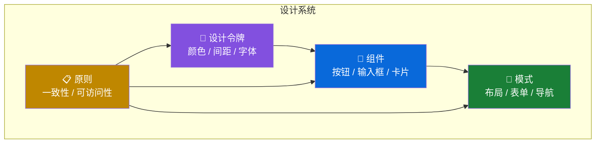
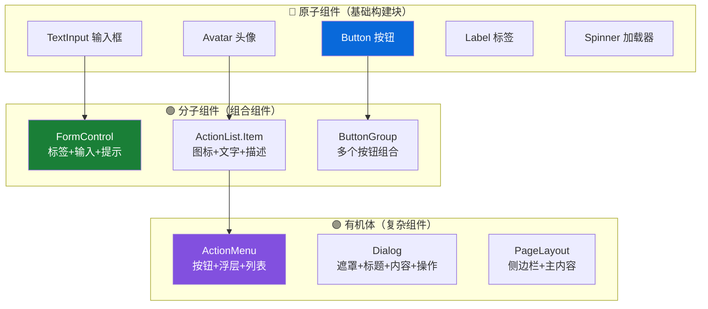

# 🎨 设计系统基础（Design System Fundamentals）

> 本篇目标：理解 Primer 设计系统的核心理念、设计哲学和基本概念，为后续深入学习打下基础。

---

## 📌 什么是设计系统？

在深入 Primer 之前，先理解"设计系统"的概念。

**类比**：如果一个产品是一栋建筑，那么：

| 建筑                          | 设计系统                                    |
| ----------------------------- | ------------------------------------------- |
| 🧱 砖块的尺寸和材质           | 设计令牌（Design Tokens）——颜色、间距、字体 |
| 📐 建筑规范（层高、通道宽度） | 设计原则（Guidelines）——间距规范、排版规范  |
| 🚪 标准化的门窗               | 组件（Components）——按钮、输入框、对话框    |
| 🏠 户型方案                   | 模式（Patterns）——页面布局、表单流程        |

**设计系统 = 设计令牌 + 组件 + 模式 + 原则**



---

## 🌟 Primer 的设计哲学

Primer 是 GitHub 的设计系统，它的名字来源于"底漆"（Primer Coat）——在绘画中，底漆是第一层涂料，为后续的颜色提供基础。

### 四大核心原则

来源于 Primer React 的官方设计原则文档：

#### 1. 🤝 沟通（Communication）

> "成为设计与工程之间的桥梁，而不是障碍。"

- 设计和开发使用**相同的词汇**
  - 设计师说"Primary Button"，开发者写 `<Button variant="primary">`
- 组件名称要**直觉性**
  - 看到 `ActionList` 就知道是"可操作的列表"
  - 看到 `FormControl` 就知道是"表单控件"

#### 2. ⚖️ 判断力（Judgment）

> "强观点，弱坚持。"

- 设计决策必须**有理有据**
- 但也要**灵活调整**——当新的证据出现时，不怕改变方向
- 评估**风险**而不仅仅是功能
  - 例如：CSS Modules 迁移是因为性能数据证明它更好

#### 3. 💡 创新（Innovation）

> "把一切视为实验，小步快跑。"

- 新组件先进入 **experimental**（实验阶段），收集反馈
- 不断迭代，而不是追求一步到位
- **减少复杂性**来加速创新

#### 4. 🔧 实现（Implementation）

> "工程化只需'刚好够用'；声明式优于巧妙抽象。"

- 代码**直观可读**比**精巧高效**更重要
- 假设使用者**会打破规则**，因此提供**安全的逃生通道**
  - 例如：组件接受 `className` prop，让使用者可以添加自定义样式

---

## 🧩 核心概念解释

### 设计令牌（Design Tokens）

设计令牌是设计系统中最小的设计决策单元。它们是**具有名字的设计值**。

```
颜色示例：
┌─────────────────────────────────────────┐
│  原始值        →  令牌名称              │
│  #0969da       →  --color-accent        │
│  #1f2328       →  --color-fg-default    │
│  #656d76       →  --color-fg-muted      │
│  #ffffff       →  --color-bg-default    │
└─────────────────────────────────────────┘

间距示例：
┌─────────────────────────────────────────┐
│  4px           →  --space-1             │
│  8px           →  --space-2             │
│  16px          →  --space-3             │
│  24px          →  --space-4             │
│  32px          →  --space-5             │
└─────────────────────────────────────────┘
```

**为什么不直接使用数值？**

| 直接使用数值                 | 使用设计令牌                 |
| ---------------------------- | ---------------------------- |
| `color: #0969da`             | `color: var(--color-accent)` |
| 改主题需要找到所有 `#0969da` | 改主题只需要改令牌的值       |
| 其他人看到数值不知道含义     | 令牌名称表达了设计意图       |
| 不一致——可能有人用 `#0968da` | 统一——所有人用同一个令牌     |

### 语义化命名

Primer 的设计令牌采用**语义化命名**——名字表达"用途"，而不是"外观"：

```
✅ 语义化命名（推荐）：
  --fgColor-default      → "默认前景色"（不管是黑色还是白色）
  --bgColor-danger-muted → "危险状态的柔和背景色"
  --borderColor-default  → "默认边框色"

❌ 外观命名（不推荐）：
  --color-black          → 在暗色模式中，"黑色"可能是白色
  --color-red-light      → "浅红"在不同主题中可能不同
  --border-gray          → "灰色边框"只描述了颜色，没描述用途
```

### 组件（Components）

组件是设计系统的可复用构建块。Primer React 提供 60+ 组件：



这种分层借鉴了 **Atomic Design（原子设计）** 的理念：

- **原子**：最基础的 UI 元素
- **分子**：多个原子的组合
- **有机体**：多个分子的组合，形成完整功能

---

## 🎭 主题与颜色模式

### 颜色模式

Primer 支持三种颜色模式：

| 模式             | 说明               | 适用场景 |
| ---------------- | ------------------ | -------- |
| ☀️ 亮色（Light） | 白色背景、深色文字 | 日间使用 |
| 🌙 暗色（Dark）  | 深色背景、浅色文字 | 夜间使用 |
| 🔄 自动（Auto）  | 跟随系统设置       | 最佳体验 |

### 颜色分类

```
功能色（Functional Colors）：
┌──────────────────────────────────────────────┐
│  🔵 Accent  →  强调色（链接、主要按钮）      │
│  🟢 Success →  成功色（成功提示、合并状态）    │
│  🟡 Attention → 注意色（警告提示）            │
│  🟠 Severe  →  严重色（严重警告）             │
│  🔴 Danger  →  危险色（删除、错误）           │
│  ⚪ Neutral →  中性色（文字、边框、背景）      │
└──────────────────────────────────────────────┘
```

### 颜色角色

每种功能色都有不同的"角色"：

```
以 Accent（强调色）为例：
┌──────────────────────────────────────────────┐
│  bgColor-accent-emphasis   →  强调背景       │
│  bgColor-accent-muted      →  柔和背景       │
│  fgColor-accent            →  前景色         │
│  borderColor-accent-emphasis → 强调边框      │
│  borderColor-accent-muted  →  柔和边框       │
└──────────────────────────────────────────────┘
```

---

## 📏 间距系统

Primer 使用 **4px 为基数** 的间距系统：

```
间距阶梯：
┌────────────────────────────────┐
│  space-0  =  0px   ■          │
│  space-1  =  4px   ■■         │
│  space-2  =  8px   ■■■■       │
│  space-3  =  16px  ■■■■■■■■   │
│  space-4  =  24px  ■■■■■■■■■■■│
│  space-5  =  32px  ...        │
│  space-6  =  40px  ...        │
└────────────────────────────────┘
```

**为什么用 4px 基数？**

- 4px 可以整除 8、12、16、20、24 等常见尺寸
- 在不同分辨率的屏幕上都能对齐像素
- 与 8px 网格系统完美兼容

---

## 📝 排版系统

### 字体

```
字体堆叠（Font Stack）：
┌──────────────────────────────────────────────┐
│  正文字体：                                   │
│  -apple-system, BlinkMacSystemFont,          │
│  "Segoe UI", "Noto Sans", Helvetica, Arial   │
│                                               │
│  等宽字体：                                   │
│  ui-monospace, SFMono-Regular, SF Mono,       │
│  Menlo, Consolas, monospace                   │
└──────────────────────────────────────────────┘
```

### 字号阶梯

```
字号         行高         用途
12px        1.5          辅助文字、标注
14px        1.5          正文、列表项
16px        1.5          大正文、表单
20px        1.5          小标题（H4）
24px        1.5          中标题（H3）
32px        1.5          大标题（H2）
40px        1.25         页面标题（H1）
```

### 字重

| 名称     | 值  | 用途     |
| -------- | --- | -------- |
| Light    | 300 | 很少使用 |
| Normal   | 400 | 正文     |
| Semibold | 500 | 强调文字 |
| Bold     | 600 | 标题     |

---

## 📐 断点系统

Primer 定义了四个响应式断点：

```
断点：
┌──────────────────────────────────────────────┐
│  narrow    <  544px   📱 手机              │
│  regular   >= 544px   📱 大手机 / 小平板    │
│  medium    >= 768px   📱 平板               │
│  wide      >= 1012px  💻 桌面              │
│  x-wide    >= 1280px  🖥️ 大屏桌面          │
└──────────────────────────────────────────────┘
```

---

## 🏢 设计系统在组织中的价值

### 对设计师的价值

| 没有设计系统           | 有设计系统         |
| ---------------------- | ------------------ |
| 每次从零设计组件       | 从组件库中选择     |
| 不同设计师风格不一     | 统一的视觉语言     |
| 设计稿与开发结果不一致 | 设计和代码一一对应 |
| 无障碍需要额外考虑     | 组件内置无障碍支持 |

### 对开发者的价值

| 没有设计系统         | 有设计系统         |
| -------------------- | ------------------ |
| 每次从零写样式代码   | 导入组件即可使用   |
| 跨浏览器兼容自己处理 | 组件库已处理       |
| 无障碍需要手动实现   | 组件内置 ARIA 支持 |
| 维护成本高           | 统一维护和升级     |

---

## ✅ 本章小结

| 概念        | 核心要点                              |
| ----------- | ------------------------------------- |
| 设计系统    | 令牌 + 组件 + 模式 + 原则的完整体系   |
| Primer 哲学 | 沟通、判断、创新、实现                |
| 设计令牌    | 语义化命名的最小设计决策单元          |
| 颜色系统    | 6 种功能色 × 多种角色，支持亮/暗/自动 |
| 间距系统    | 4px 基数的间距阶梯                    |
| 排版系统    | 系统字体堆叠 + 6 级字号               |

---

## ➡️ 下一步

继续阅读 [02 - 设计令牌与主题](./02-design-tokens-and-theming.md)，深入了解 Primer 的完整设计令牌体系和主题切换机制。
