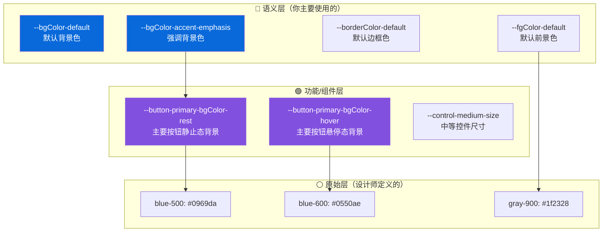
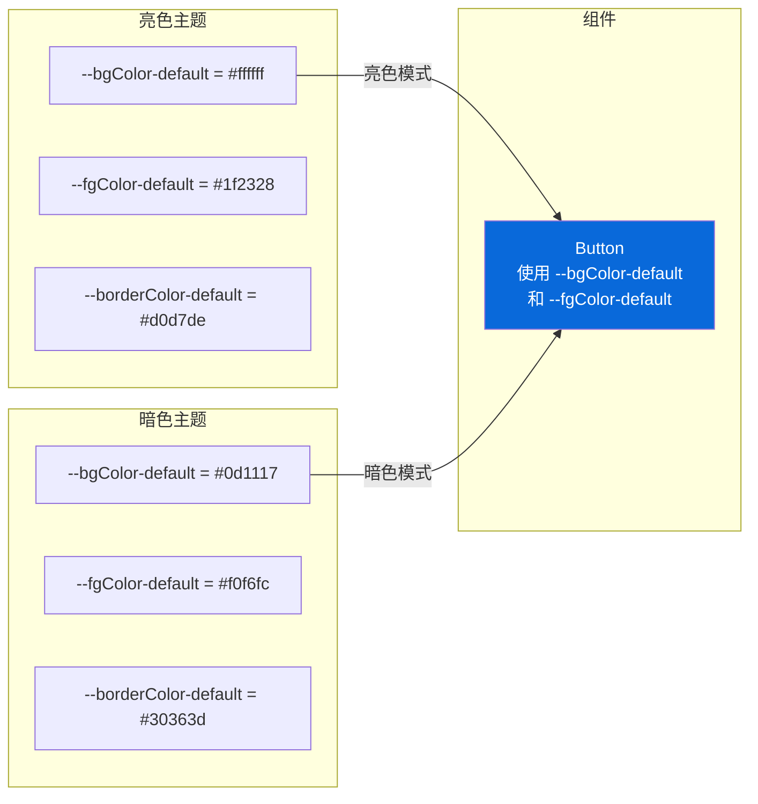

# 🎨 设计令牌与主题（Design Tokens & Theming）

> 本篇目标：深入理解 Primer 的设计令牌体系、主题切换机制，以及如何在设计工作中运用这些概念。

---

## 🏗️ 设计令牌的三层架构

Primer 的设计令牌并不是简单的"变量 = 值"，而是一个精心设计的三层系统：



### 为什么要分三层？

**类比**：想象你在管理一个城市的路灯系统：

| 层级   | 路灯类比                   | 设计令牌                        |
| ------ | -------------------------- | ------------------------------- |
| 原始层 | 灯泡型号：LED-A19, 60W     | `blue-500: #0969da`             |
| 功能层 | 路灯类型：主干道灯、小区灯 | `--button-primary-bgColor-rest` |
| 语义层 | 用途：照明设施             | `--bgColor-accent-emphasis`     |

当需要"换灯泡"时：

- 只改**原始层**的值（换新型号灯泡）
- 功能层和语义层的**名称不变**
- 所有使用这些令牌的地方**自动更新**

---

## 🎨 颜色令牌详解

### 颜色命名规则

Primer 的颜色令牌名称遵循严格的命名规则：

```
--[角色]-[功能]-[变体]

角色（Role）：
  bgColor    = 背景色（Background Color）
  fgColor    = 前景色（Foreground Color，文字/图标）
  borderColor = 边框色（Border Color）

功能（Function）：
  default    = 默认
  muted      = 柔和/弱化
  emphasis   = 强调
  accent     = 强调色（蓝色系）
  success    = 成功色（绿色系）
  attention  = 注意色（黄色系）
  severe     = 严重色（橙色系）
  danger     = 危险色（红色系）

变体（Variant）：
  rest       = 静止态
  hover      = 悬停态
  active     = 激活态
  disabled   = 禁用态
```

### 颜色令牌示例

```
背景色（bgColor）：
┌──────────────────────────────────────────────────────┐
│  --bgColor-default          白色 / 深灰（暗色模式）   │
│  --bgColor-muted            浅灰 / 深色              │
│  --bgColor-accent-emphasis  蓝色（主题强调色）        │
│  --bgColor-success-emphasis 绿色（成功）              │
│  --bgColor-danger-emphasis  红色（危险）              │
│  --bgColor-accent-muted     浅蓝色（柔和强调）       │
└──────────────────────────────────────────────────────┘

前景色（fgColor）：
┌──────────────────────────────────────────────────────┐
│  --fgColor-default          主文字色                  │
│  --fgColor-muted            辅助文字色                │
│  --fgColor-accent           强调文字色（链接等）      │
│  --fgColor-onEmphasis       在强调背景上的文字色      │
│  --fgColor-success          成功状态文字色            │
│  --fgColor-danger           危险/错误文字色           │
└──────────────────────────────────────────────────────┘
```

### 交互状态颜色

```
按钮（Primary Button）的状态颜色变化：

静止态（Rest）：
┌──────────────────────┐
│   ████████████████   │  --button-primary-bgColor-rest
│   ██ 提交更改 ██████  │  背景：#1a7f37（绿色）
│   ████████████████   │  文字：#ffffff（白色）
└──────────────────────┘

悬停态（Hover）：
┌──────────────────────┐
│   ████████████████   │  --button-primary-bgColor-hover
│   ██ 提交更改 ██████  │  背景：#2c974b（浅绿）
│   ████████████████   │  文字：#ffffff
└──────────────────────┘

激活态（Active）：
┌──────────────────────┐
│   ████████████████   │  --button-primary-bgColor-active
│   ██ 提交更改 ██████  │  背景：#298e46（中绿）
│   ████████████████   │  文字：#ffffff
└──────────────────────┘

禁用态（Disabled）：
┌──────────────────────┐
│   ░░░░░░░░░░░░░░░░   │  --button-primary-bgColor-disabled
│   ░░ 提交更改 ░░░░░░  │  背景：#94d3a2（浅绿）
│   ░░░░░░░░░░░░░░░░   │  文字：rgba(255,255,255,0.8)
└──────────────────────┘
```

---

## 🌗 主题切换机制

### 主题如何工作？



**核心原理**：同一个 CSS 变量名，在不同主题下映射到不同的值。组件只使用变量名，不关心具体值。

### 主题方案

Primer 提供以下预设主题方案：

| 方案名称              | 风格         | 适用场景     |
| --------------------- | ------------ | ------------ |
| `light`               | 标准亮色     | 日间默认     |
| `light_colorblind`    | 色盲友好亮色 | 色觉障碍用户 |
| `light_high_contrast` | 高对比度亮色 | 视力障碍用户 |
| `dark`                | 标准暗色     | 夜间默认     |
| `dark_dimmed`         | 柔和暗色     | 低光环境     |
| `dark_colorblind`     | 色盲友好暗色 | 色觉障碍用户 |
| `dark_high_contrast`  | 高对比度暗色 | 视力障碍用户 |

### 为什么有色盲友好和高对比度方案？

**无障碍（Accessibility）** 是 Primer 的核心原则之一。

- **色盲友好**：避免仅靠颜色传达信息，调整色相以适应色觉障碍
- **高对比度**：增大前景色与背景色的对比度，满足 WCAG 2.1 标准

---

## 📏 尺寸与间距令牌

### 控件尺寸

Primer 定义了三个标准控件尺寸：

```
控件尺寸：
┌──────────────────────────────────────────────┐
│  small:   28px  ┌─────────────┐             │
│                 │ Small Button │             │
│                 └─────────────┘             │
│                                              │
│  medium:  32px  ┌───────────────┐           │
│                 │ Medium Button │           │
│                 └───────────────┘           │
│                                              │
│  large:   40px  ┌─────────────────┐         │
│                 │  Large Button   │         │
│                 └─────────────────┘         │
└──────────────────────────────────────────────┘
```

对应的令牌：

| 令牌                    | 值   | 用途             |
| ----------------------- | ---- | ---------------- |
| `--control-small-size`  | 28px | 紧凑场景         |
| `--control-medium-size` | 32px | 默认尺寸         |
| `--control-large-size`  | 40px | 需要更大点击区域 |

### 内边距

```
控件内边距（Padding）：
┌──────────────────────────────────────────────┐
│  condensed:  4px   →  紧凑内边距            │
│  normal:     8px   →  默认内边距            │
│  spacious:   12px  →  宽松内边距            │
└──────────────────────────────────────────────┘
```

---

## 🖼️ 阴影与圆角

### 阴影令牌

```
阴影层级：
┌──────────────────────────────────────────────┐
│  shadow-small   →  微弱阴影（卡片边缘）      │
│  shadow-medium  →  中等阴影（下拉菜单）      │
│  shadow-large   →  明显阴影（对话框）        │
│  shadow-extra-large → 强阴影（全屏浮层）     │
└──────────────────────────────────────────────┘
```

### 圆角令牌

```
圆角值：
┌──────────────────────────────────────────────┐
│  radii-0  =  0px    →  无圆角              │
│  radii-1  =  3px    →  微圆角（输入框）     │
│  radii-2  =  6px    →  标准圆角（按钮、卡片）│
│  radii-3  =  100px  →  全圆角（徽章、标签） │
└──────────────────────────────────────────────┘
```

---

## 🔗 设计令牌在设计工具中的应用

### Figma 中使用 Primer

Primer 提供了 Figma 组件库，其中的样式和变量与代码中的令牌一一对应：

| Figma 样式        | 代码令牌                    | 用途     |
| ----------------- | --------------------------- | -------- |
| `fg/default`      | `--fgColor-default`         | 默认文字 |
| `bg/default`      | `--bgColor-default`         | 默认背景 |
| `border/default`  | `--borderColor-default`     | 默认边框 |
| `accent/emphasis` | `--bgColor-accent-emphasis` | 强调背景 |

### 设计师与开发者的沟通

使用设计令牌作为沟通语言，可以消除歧义：

```
❌ 模糊的沟通：
  设计师："这个按钮用蓝色背景"
  开发者："什么蓝色？#0969da 还是 #0550ae？"

✅ 精确的沟通：
  设计师："这个按钮使用 accent-emphasis 背景色"
  开发者："明白，--bgColor-accent-emphasis"
```

---

## 🧪 设计令牌的实际应用

### 卡片设计示例

```
┌──────────────── 卡片 ──────────────────┐
│  背景：--bgColor-default               │
│  边框：--borderColor-default           │
│  圆角：--borderRadius-medium (6px)     │
│  内边距：--space-3 (16px)              │
│                                        │
│  ┌─ 标题 ───────────────────────┐     │
│  │  颜色：--fgColor-default      │     │
│  │  字号：16px                    │     │
│  │  字重：semibold (500)          │     │
│  └──────────────────────────────┘     │
│                                        │
│  ┌─ 描述 ───────────────────────┐     │
│  │  颜色：--fgColor-muted        │     │
│  │  字号：14px                    │     │
│  │  字重：normal (400)            │     │
│  └──────────────────────────────┘     │
│                                        │
│  ┌─ 操作 ───────┐                     │
│  │ Primary Button│  accent-emphasis    │
│  └──────────────┘                     │
└────────────────────────────────────────┘
```

在暗色模式下，所有令牌的值自动变化，卡片的外观随之适应——**无需任何额外设计**。

---

## ✅ 本章小结

| 概念       | 核心要点                              |
| ---------- | ------------------------------------- |
| 三层架构   | 原始层→功能层→语义层，改一处更新全局  |
| 颜色命名   | `--[角色]-[功能]-[变体]` 的语义化命名 |
| 交互状态   | rest/hover/active/disabled 四态系统   |
| 主题切换   | 同名变量不同值，组件自动适应          |
| 无障碍方案 | 色盲友好 + 高对比度方案               |
| 设计协作   | 令牌作为设计师与开发者的共同语言      |

---

## ➡️ 下一步

继续阅读 [03 - 组件全景图](./03-component-gallery.md)，全面了解 Primer React 提供的 60+ 组件及其使用场景。
