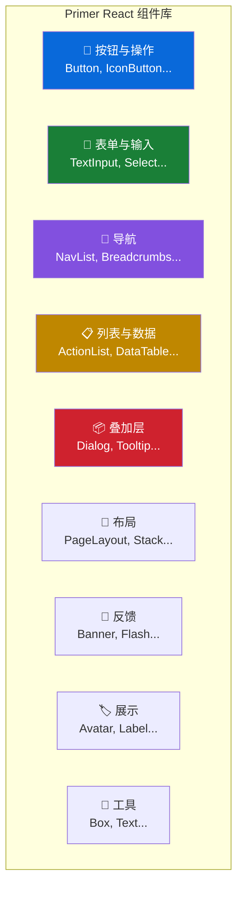

# 🧩 组件全景图（Component Gallery）

> 本篇目标：全面了解 Primer React 提供的 60+ 组件，理解每个组件的用途、使用场景和关键特性。

---

## 📊 组件分类总览



---

## 🔘 按钮与操作（Buttons & Actions）

按钮是用户界面中最基础的交互元素。

### Button 按钮

**变体**：

```
┌─────────────┐  ┌─────────────┐  ┌─────────────┐  ┌─────────────┐
│   Default    │  │   Primary   │  │   Danger     │  │    Link     │
│   默认按钮   │  │   主要按钮   │  │  危险按钮    │  │  链接按钮   │
└─────────────┘  └─────────────┘  └─────────────┘  └─────────────┘
  灰色边框/背景    绿色/蓝色背景      红色背景       无背景，链接样式
  一般操作         主要操作          删除/破坏操作    次要导航操作
```

**尺寸**：

```
small  (28px)  ┌─────────┐  紧凑场景，如表格内操作
               │  Small   │
               └─────────┘

medium (32px)  ┌───────────┐  默认尺寸
               │  Medium   │
               └───────────┘

large  (40px)  ┌─────────────┐  重要操作，如页面主按钮
               │   Large     │
               └─────────────┘
```

**特殊功能**：
- 📎 **前置/后置图标**：`leadingVisual` / `trailingVisual`
- 🔢 **计数器**：`count` prop 显示数字徽标
- ⏳ **加载状态**：`loading` prop 自动显示 Spinner
- 🔗 **多态**：可以渲染为 `<a>` 标签或 Router Link

### IconButton 图标按钮

仅显示图标的按钮，**必须提供 `aria-label`** 以确保无障碍。

```
┌───┐  ┌───┐  ┌───┐  ┌───┐
│ 🔍 │  │ ✏️ │  │ ⚙️ │  │ ✕ │
└───┘  └───┘  └───┘  └───┘
搜索    编辑    设置    关闭
```

### ButtonGroup 按钮组

将多个按钮组合为一组，视觉上连接在一起：

```
┌──────────┬──────────┬──────────┐
│  选项 A   │  选项 B   │  选项 C  │
└──────────┴──────────┴──────────┘
```

---

## 📝 表单与输入（Forms & Input）

### FormControl 表单控件

**设计要点**：FormControl 是表单元素的标准容器，它自动处理标签关联和无障碍。

```
┌──────────────────────────────────────┐
│  📎 用户名 *                          │  ← Label（标签）
│  ┌────────────────────────────────┐  │
│  │  请输入用户名                   │  │  ← Input（输入）
│  └────────────────────────────────┘  │
│  ⓘ 用户名将公开显示                  │  ← Caption（说明）
│  ⚠️ 用户名已被占用                    │  ← Validation（验证提示）
└──────────────────────────────────────┘
```

### 输入类型

| 组件 | 用途 | 场景 |
|------|------|------|
| `TextInput` | 单行文本 | 用户名、邮箱、搜索 |
| `Textarea` | 多行文本 | 评论、描述、正文 |
| `Select` | 下拉选择 | 语言选择、角色选择 |
| `Checkbox` | 复选框 | 多选项、同意条款 |
| `Radio` | 单选框 | 单选项 |
| `CheckboxGroup` | 复选框组 | 多选场景，带标题和描述 |
| `RadioGroup` | 单选框组 | 单选场景，带标题和描述 |
| `ToggleSwitch` | 开关 | 功能开启/关闭 |

---

## 🧭 导航（Navigation）

### NavList 导航列表

侧边栏导航的首选组件：

```
┌──────────────────────────┐
│  🏠 首页        ← 选中    │
│  📦 仓库                  │
│  📋 议题         12       │
│  🔀 拉取请求     3        │
│  ⚙️ 设置                  │
└──────────────────────────┘
```

**特性**：
- 支持层级展开/折叠
- 当前页面高亮（`aria-current`）
- 图标 + 计数器
- 键盘导航（方向键）

### UnderlineNav 下划线导航

标签页风格的导航：

```
   代码     议题(12)    拉取请求(3)     讨论     操作
   ─────   ═══════════  
              ↑ 选中态（下划线高亮）
```

### Breadcrumbs 面包屑导航

路径层级导航：

```
  首页  /  仓库  /  设置  /  协作者
  ← 可点击 →  ← 可点击 →      ↑ 当前页
```

---

## 📋 列表与数据（Lists & Data）

### ActionList 操作列表

最灵活的列表组件，支持丰富的内容结构：

```
┌──────────────────────────────────────┐
│  👤 搜索用户                          │
│     username • 用户描述               │
├──────────────────────────────────────┤
│  📂 搜索仓库                          │
│     repo/name • 仓库描述              │
├──────────────────────────────────────┤
│  🗑️ 删除                       ⌘D    │  ← 危险操作（红色）
└──────────────────────────────────────┘
```

**使用场景**：
- 下拉菜单选项
- 侧边栏导航
- 筛选面板
- 命令面板

### ActionMenu 操作菜单

按钮 + 浮层 + 操作列表的组合：

```
  ┌───────────┐
  │  操作  ▾  │  ← 触发按钮
  └───────────┘
       │
       ▼
  ┌──────────────┐
  │  ✏️ 编辑      │
  │  📋 复制      │
  │  ────────────│
  │  🗑️ 删除      │  ← 危险操作
  └──────────────┘
```

### DataTable 数据表格

用于展示结构化数据：

```
┌──────────────────────────────────────────┐
│  名称          │  语言        │  ⭐ Stars │
├──────────────────────────────────────────┤
│  primer-react  │  TypeScript  │   3,200  │
│  octicons      │  JavaScript  │   8,100  │
│  css           │  CSS         │  12,400  │
└──────────────────────────────────────────┘
```

**特性**：排序、虚拟滚动、自定义单元格渲染。

### TreeView 树形视图

文件目录结构的展示：

```
📂 src
├── 📂 components
│   ├── 📄 Button.tsx
│   ├── 📄 Input.tsx
│   └── 📂 utils
│       └── 📄 helpers.ts
├── 📄 App.tsx
└── 📄 index.ts
```

---

## 📦 叠加层（Overlays）

### Dialog 对话框

模态对话框，用于需要用户关注的操作：

```
    ┌──────────────────────────────┐
    │  ✕                           │
    │  确认删除仓库                 │
    │                              │
    │  此操作不可撤销。             │
    │  确定要删除 my-repo 吗？     │
    │                              │
    │        [取消]  [确认删除]     │
    └──────────────────────────────┘
```

**设计要点**：
- 打开时阻止背景交互（焦点陷阱）
- 关闭时焦点返回触发元素
- 按 `Escape` 关闭

### Tooltip 工具提示

悬停时显示额外信息：

```
        ┌──────────────────┐
        │ 复制到剪贴板     │  ← 提示内容
        └────────┬─────────┘
                 │
              ┌──┐
              │📋│  ← 触发元素
              └──┘
```

**使用规范**：
- 仅用于辅助说明，不放关键信息
- 不包含可交互内容（链接、按钮）
- 保持文字简短

### AnchoredOverlay 锚定浮层

通用的锚定浮层，是 ActionMenu、Tooltip 等组件的基础：

```
  ┌─────────┐
  │ 触发器  │  ← 锚点元素
  └─────────┘
       │
       ▼
  ┌───────────────┐
  │               │  ← 浮层内容
  │  任意内容      │     自动定位
  │               │     避免溢出视口
  └───────────────┘
```

---

## 📐 布局（Layout）

### PageLayout 页面布局

用于构建带侧边栏的页面：

```
┌──────────────────────────────────────────────┐
│  ┌──────────┐  ┌───────────────────────────┐ │
│  │          │  │                           │ │
│  │  侧边栏  │  │        主内容区            │ │
│  │  (Pane)  │  │       (Content)           │ │
│  │          │  │                           │ │
│  │          │  │                           │ │
│  └──────────┘  └───────────────────────────┘ │
└──────────────────────────────────────────────┘

窄屏时侧边栏自动折叠到内容下方：

┌──────────────────────┐
│                      │
│      主内容区         │
│     (Content)        │
│                      │
├──────────────────────┤
│      侧边栏          │
│      (Pane)          │
└──────────────────────┘
```

### Stack 堆叠布局

简单的弹性布局容器：

```
垂直堆叠：                 水平堆叠：
┌──────────┐             ┌────┐ ┌────┐ ┌────┐
│  Item 1  │             │ A  │ │ B  │ │ C  │
├──────────┤             └────┘ └────┘ └────┘
│  Item 2  │
├──────────┤
│  Item 3  │
└──────────┘
```

---

## 💬 反馈（Feedback）

### Banner 横幅通知

页面级别的通知消息：

```
┌──────────────────────────────────────────────┐
│  ⓘ  新版本可用！点击此处了解更新内容。   [✕] │
└──────────────────────────────────────────────┘

┌──────────────────────────────────────────────┐
│  ⚠️  你的试用期即将到期。          [升级] [✕] │
└──────────────────────────────────────────────┘

┌──────────────────────────────────────────────┐
│  ❌  操作失败，请重试。               [重试]  │
└──────────────────────────────────────────────┘
```

**变体**：`info`（蓝）、`warning`（黄）、`critical`（红）、`success`（绿）

### Spinner 加载指示器

```
  ⟳  加载中...
```

**尺寸**：`small`（16px）、`medium`（32px）、`large`（64px）

### ProgressBar 进度条

```
██████████████░░░░░░░░░░░░  56%
```

---

## 🏷️ 展示（Display）

### Avatar / AvatarStack 头像

```
单个头像：    头像堆叠：
┌────┐      ┌──┐
│ 🧑 │      │🧑│🧑│🧑│ +3
└────┘      └──┘
```

### StateLabel 状态标签

用于显示 Issue/PR 的状态：

```
🟢 Open    🟣 Merged    🔴 Closed    📝 Draft
```

### CounterLabel 计数器

```
  Issues  [12]    Pull Requests  [3]
```

### Blankslate 空状态

当列表为空时的占位展示：

```
┌──────────────────────────────────────┐
│                                      │
│          📋                          │
│                                      │
│      暂无议题                        │
│      创建你的第一个议题来开始吧      │
│                                      │
│         [新建议题]                    │
│                                      │
└──────────────────────────────────────┘
```

### RelativeTime 相对时间

```
  3 minutes ago    →   3 分钟前
  2 hours ago      →   2 小时前
  yesterday        →   昨天
```

---

## 🔧 工具组件（Utility）

| 组件 | 用途 | 场景 |
|------|------|------|
| `Box` | 通用容器 | 任何需要容器的场景 |
| `Text` | 文本容器 | 控制文字样式 |
| `Heading` | 标题 | 语义化标题 h1-h6 |
| `Link` | 链接 | 导航链接 |
| `VisuallyHidden` | 视觉隐藏 | 仅屏幕阅读器可见 |
| `Hidden` | 条件隐藏 | 响应式隐藏/显示 |
| `Truncate` | 文本截断 | 长文本溢出处理 |
| `Octicon` | 图标 | 渲染 Octicons 图标 |

---

## ✅ 本章小结

Primer React 的 60+ 组件覆盖了几乎所有 Web UI 场景：

| 类别 | 核心组件 | 设计要点 |
|------|---------|---------|
| 按钮 | Button, IconButton | 4 种变体，3 种尺寸 |
| 表单 | FormControl, TextInput | 标签-输入-验证的完整体系 |
| 导航 | NavList, Breadcrumbs | 键盘导航，当前页高亮 |
| 列表 | ActionList, DataTable | 灵活的内容结构，虚拟滚动 |
| 叠加层 | Dialog, ActionMenu | 焦点管理，Escape 关闭 |
| 布局 | PageLayout, Stack | 响应式，窄屏自适应 |
| 反馈 | Banner, Spinner | 4 种状态颜色 |
| 展示 | Avatar, StateLabel | 语义化状态展示 |

---

## ➡️ 下一步

继续阅读 [04 - 设计模式与最佳实践](./04-design-patterns.md)，学习如何运用这些组件构建一致、高效的用户界面。
