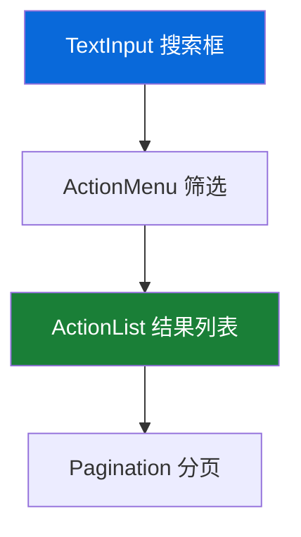
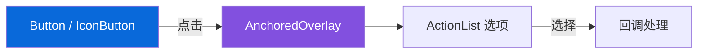
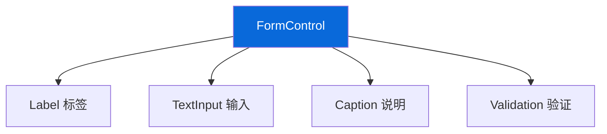

# 🎯 设计模式与最佳实践（Design Patterns & Best Practices）

> 本篇目标：学习如何运用 Primer 组件和设计令牌构建一致、高效、可访问的用户界面，并掌握与开发者高效协作的方法。

---

## 📐 布局模式

### 模式一：标准页面布局

GitHub 最常见的页面结构——左侧导航 + 右侧内容：

```
┌──────────────────────────────────────────────────────┐
│  [Logo]  搜索框                    [通知] [新建▾] [头像]│  ← Header
├──────────┬───────────────────────────────────────────┤
│          │  📂 仓库名 / 路径                         │
│  🏠 首页  │  ════════════════════                    │
│  📦 仓库  │                                          │
│  📋 议题  │  主内容区域                               │
│  🔀 PR   │                                          │
│  ⚙️ 设置  │  - 列表                                  │
│          │  - 详情                                   │
│          │  - 操作                                   │
├──────────┴───────────────────────────────────────────┤
│  Footer                                              │
└──────────────────────────────────────────────────────┘
```

**使用的组件**：
- `PageLayout` + `PageLayout.Pane` + `PageLayout.Content`
- `NavList` 用于侧边栏导航
- `PageHeader` 用于内容区顶部

### 模式二：表单页面

```
┌──────────────────────────────────────────────────┐
│  ← 返回                                          │
│                                                  │
│  创建新仓库                                       │
│  ══════════                                      │
│                                                  │
│  仓库名称 *                                       │
│  ┌────────────────────────────┐                  │
│  │  my-awesome-project        │                  │
│  └────────────────────────────┘                  │
│  ⓘ 好的仓库名应该简短且有意义                    │
│                                                  │
│  描述（可选）                                      │
│  ┌────────────────────────────┐                  │
│  │                            │                  │
│  │                            │                  │
│  └────────────────────────────┘                  │
│                                                  │
│  可见性                                           │
│  ○ 公开 — 任何人都可以看到                         │
│  ● 私有 — 只有你可以看到                           │
│                                                  │
│  ┌─────────────────┐                             │
│  │  创建仓库 (Primary)│                           │
│  └─────────────────┘                             │
└──────────────────────────────────────────────────┘
```

**使用的组件**：
- `FormControl` 包裹每个表单项
- `TextInput` / `Textarea` 用于输入
- `RadioGroup` 用于单选
- `Button variant="primary"` 用于提交

### 模式三：列表 + 操作

```
┌──────────────────────────────────────────────────┐
│  议题列表                             [新建议题]  │
│  ══════════                                      │
│                                                  │
│  🔍 筛选  │ 作者 ▾ │ 标签 ▾ │ 里程碑 ▾            │
│                                                  │
│  ┌──────────────────────────────────────────┐    │
│  │  ☑ 🟢 修复登录页面的样式问题       #123    │    │
│  │     bug • 3 天前 • octocat                │    │
│  ├──────────────────────────────────────────┤    │
│  │  ☐ 🟢 添加暗色模式支持             #124    │    │
│  │     enhancement • 1 天前 • hubot          │    │
│  ├──────────────────────────────────────────┤    │
│  │  ☐ 🔴 重构导航组件                 #125    │    │
│  │     refactor • 5 小时前 • monalisa        │    │
│  └──────────────────────────────────────────┘    │
│                                                  │
│  ◀ 上一页  1  2  3  下一页 ▶                      │
└──────────────────────────────────────────────────┘
```

**使用的组件**：
- `ActionMenu` 用于筛选下拉
- `ActionList` 用于列表项
- `StateLabel` 用于状态标识
- `Label` 用于标签
- `RelativeTime` 用于时间
- `Pagination` 用于分页

---

## 🎨 颜色使用规范

### 功能色的使用原则

| 功能色 | 使用场景 | 注意事项 |
|--------|---------|---------|
| 🔵 Accent | 链接、主要按钮、选中态 | 不要滥用，仅用于需要引起注意的元素 |
| 🟢 Success | 成功消息、合并状态、完成指示 | 不要用于与"成功"无关的绿色装饰 |
| 🟡 Attention | 警告消息、待处理事项 | 要搭配文字说明，不能仅靠颜色传达 |
| 🔴 Danger | 错误消息、删除操作、关闭状态 | 破坏性操作必须有确认步骤 |
| ⚪ Neutral | 默认文字、边框、背景 | 大部分界面应该是中性色 |

### 对比度要求

| 场景 | WCAG 要求 | 最低对比度 |
|------|----------|-----------|
| 正常文字 | AA | 4.5:1 |
| 大文字（18px+ bold 或 24px+） | AA | 3:1 |
| 非文字元素（图标、边框） | AA | 3:1 |
| 增强对比度 | AAA | 7:1 |

> 💡 使用 Primer 的设计令牌可以自动满足对比度要求，因为令牌的值已经过计算和验证。

### 不要仅靠颜色传达信息

```
❌ 仅靠颜色区分状态：
┌────┐  ┌────┐  ┌────┐
│ 🟢 │  │ 🔴 │  │ 🟡 │   ← 色盲用户无法区分
└────┘  └────┘  └────┘

✅ 颜色 + 图标 + 文字：
┌────────────┐  ┌────────────┐  ┌────────────┐
│ ✅ 已通过   │  │ ❌ 未通过   │  │ ⚠️ 待审查   │
└────────────┘  └────────────┘  └────────────┘
```

---

## 🧩 组件组合模式

### 模式一：搜索 + 筛选 + 列表



### 模式二：触发器 + 浮层 + 操作



### 模式三：表单容器 + 输入 + 反馈



---

## ♿ 无障碍设计清单

### 设计阶段需要考虑的无障碍要素

| 检查项 | 说明 | Primer 支持 |
|--------|------|------------|
| ✅ 颜色对比度 | 文字与背景的对比度满足 WCAG AA | 令牌已内置验证 |
| ✅ 不仅靠颜色 | 用图标/文字辅助颜色信息 | 组件内置图标 |
| ✅ 焦点可见 | 键盘导航时焦点状态明显 | 组件内置焦点样式 |
| ✅ 交互目标 | 可点击区域至少 44x44px | 控件尺寸满足 |
| ✅ 文字可缩放 | 使用相对单位，支持浏览器缩放 | 令牌使用 px 但可覆盖 |
| ✅ 键盘操作 | 所有功能可通过键盘完成 | 组件内置键盘导航 |
| ✅ 屏幕阅读器 | 提供合适的 ARIA 标签 | 组件自动推断 role |

### 常见的无障碍错误

```
❌ 图标按钮没有文字说明
   → 屏幕阅读器用户不知道按钮功能
   ✅ 使用 aria-label="关闭" 或 VisuallyHidden

❌ 对话框打开时焦点没有移入
   → 键盘用户不知道对话框已打开
   ✅ Primer Dialog 自动管理焦点

❌ 自定义下拉菜单没有键盘支持
   → 键盘用户无法选择选项
   ✅ 使用 ActionMenu 自带键盘导航

❌ 动态更新的内容没有通知屏幕阅读器
   → 屏幕阅读器用户不知道内容变化
   ✅ 使用 aria-live 区域或 Primer 的内置提示
```

---

## 🤝 设计师与开发者的协作

### 建立共同词汇

| 设计师的语言 | 开发者的代码 | 统一术语 |
|------------|------------|---------|
| "主要按钮" | `variant="primary"` | Primary Button |
| "柔和的蓝色背景" | `--bgColor-accent-muted` | Accent Muted |
| "中等间距" | `--space-3` (16px) | Space 3 |
| "浮层组件" | `<AnchoredOverlay>` | Overlay |
| "选中态" | `selected={true}` | Selected State |

### 设计交付清单

当设计师将设计稿交给开发者时，建议包含以下信息：

| 信息 | 示例 | 对应代码 |
|------|------|---------|
| 组件名称 | "使用 ActionMenu" | `<ActionMenu>` |
| 变体 | "Primary Button, size medium" | `variant="primary" size="medium"` |
| 颜色令牌 | "背景色 accent-emphasis" | `--bgColor-accent-emphasis` |
| 间距 | "间距 space-3 (16px)" | `gap: var(--space-3)` |
| 交互状态 | "悬停时背景变深" | 组件内置 |
| 响应式行为 | "窄屏时侧边栏折叠" | `PageLayout.Pane` 自动处理 |

### 设计评审关注点

在设计评审（Design Review）中，重点检查：

1. **一致性**：是否使用了 Primer 组件和令牌？
2. **无障碍**：对比度、焦点状态、键盘操作是否满足？
3. **响应式**：窄屏/宽屏的布局是否合理？
4. **状态完整性**：是否考虑了所有状态（空状态、加载、错误、成功）？
5. **文案**：按钮文字、错误提示是否清晰？

---

## 📋 常见设计检查清单

### 页面设计

- [ ] 页面有清晰的标题层级（H1 → H2 → H3）
- [ ] 使用 PageLayout 或 Stack 进行布局
- [ ] 考虑了窄屏（< 544px）的展示
- [ ] 有空状态（Empty State）设计
- [ ] 有加载状态（Loading State）设计
- [ ] 有错误状态（Error State）设计

### 表单设计

- [ ] 每个输入项都有标签（Label）
- [ ] 必填项有明确标识
- [ ] 有输入说明（Caption）或示例
- [ ] 有验证错误提示
- [ ] 提交按钮有加载状态
- [ ] 有取消/返回操作

### 交互设计

- [ ] 破坏性操作（删除）有确认步骤
- [ ] 操作结果有反馈（成功/失败提示）
- [ ] 加载过程有进度指示
- [ ] 长列表有分页或虚拟滚动

---

## ✅ 全系列总结

恭喜你完成了 Primer React UI 设计师学习路线的全部内容！

回顾你学到了什么：

| 章节 | 核心收获 |
|------|---------|
| 01 设计系统基础 | Primer 的设计哲学、核心原则、基本概念 |
| 02 设计令牌与主题 | 三层令牌架构、颜色体系、主题切换 |
| 03 组件全景图 | 60+ 组件分类、使用场景、关键特性 |
| 04 设计模式 | 布局模式、颜色规范、无障碍、协作方式 |

> 🎯 **最终目标**：能够使用 Primer 的设计语言进行设计，与开发者高效沟通，交付一致、可访问、高质量的用户界面。

---

## 📚 延伸阅读

| 资源 | 说明 |
|------|------|
| [Primer 官方设计文档](https://primer.style) | 完整的设计系统文档 |
| [GitHub 无障碍指南](https://accessibility.github.com) | GitHub 的无障碍实践 |
| [WCAG 2.1 指南](https://www.w3.org/TR/WCAG21/) | Web 内容无障碍指南 |
| [Inclusive Design Principles](https://inclusivedesignprinciples.info) | 包容性设计原则 |
| [Material Design Guidelines](https://m3.material.io) | Google 设计规范参考 |

---

## ⬅️ 返回导航

- [📖 学习导航（README）](../README.md)
- [🖥️ 前端开发者学习路线](../front-end/01-getting-started.md)
